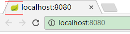
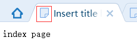
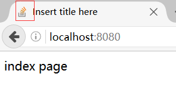

### 一. 默认的Favicon
Spring Boot提供了一个默认的Favicon,每次访问应用的时候都能看到,如下图所示:



### 二. 关闭Favicon
我们可以在application.properties中设置关闭Favicon,默认为开启,如下图所示:

```
spring.mvc.favicon.enabled=false

```



### 三.设置自己的Favicon

若需要设置自己的Favicon,则只需要将自己的favicon.ico(文件名不能变动)文件放置在类路径根目录,类路径/META-INF/resources/下,类路径resources/下,类路径static/下或类路径public/下。这里将favicon.ico放置在src/main/resources/static下,运行效果如下图所示:




