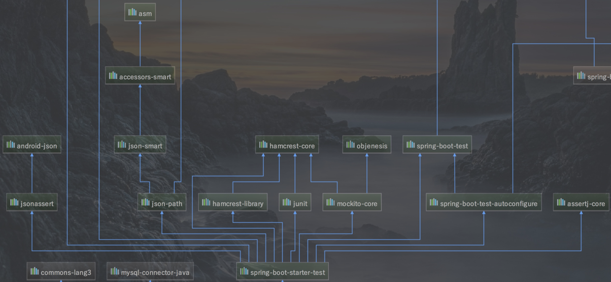
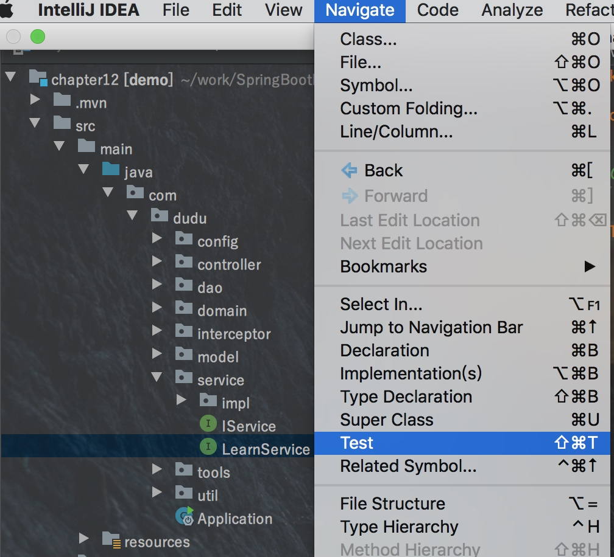
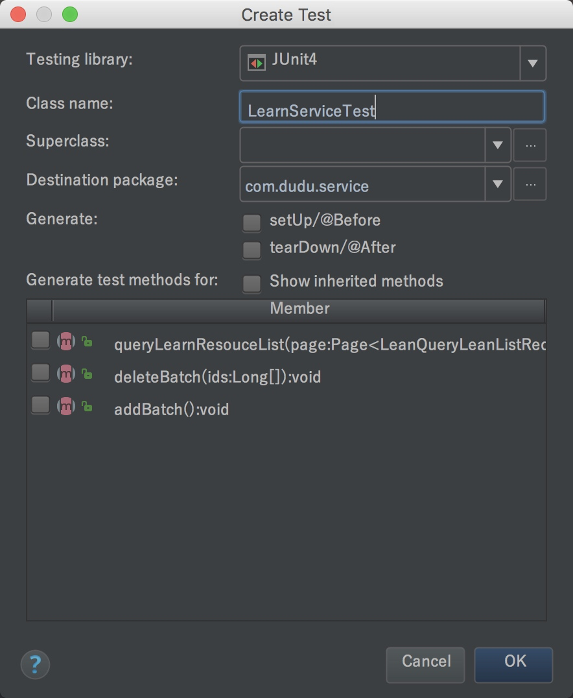
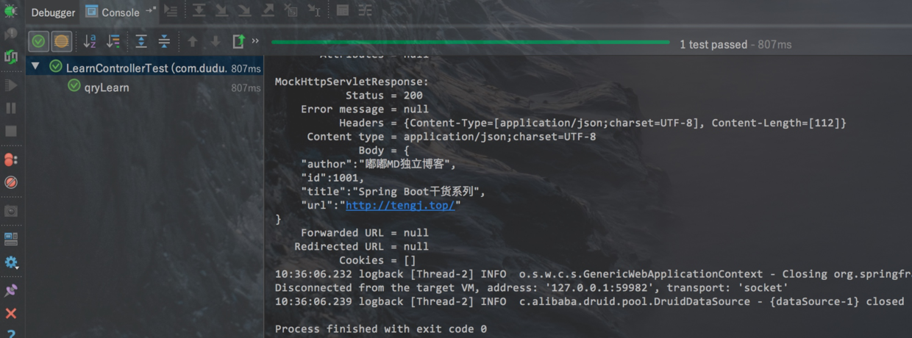

### 前言

这次来介绍下Spring Boot中对单元测试的整合使用，本篇会通过以下4点来介绍，基本满足日常需求

* Service层单元测试
* Controller层单元测试
* 新断言assertThat使用
* 单元测试的回滚

### 正文

Spring Boot中引入单元测试很简单，依赖如下：
```
<dependency>
	<groupId>org.springframework.boot</groupId>
	<artifactId>spring-boot-starter-test</artifactId>
	<scope>test</scope>
</dependency>

```
本篇实例Spring Boot版本为1.5.9.RELEASE，引入spring-boot-starter-test后，有如下几个库：
* JUnit — The de-facto standard for unit testing Java applications.
* Spring Test & Spring Boot Test — Utilities and integration test support for Spring Boot applications.
* AssertJ — A fluent assertion library.
* Hamcrest — A library of matcher objects (also known as constraints or predicates).
* Mockito — A Java mocking framework.
* JSONassert — An assertion library for JSON.
* JsonPath — XPath for JSON.



#### Service单元测试

Spring Boot中单元测试类写在在src/test/java目录下，你可以手动创建具体测试类，如果是IDEA，则可以通过IDEA自动创建测试类，如下图，也可以通过快捷键⇧⌘T(MAC)或者Ctrl+Shift+T(Window)来创建，如下：




自动生成测试类如下：


然后再编写创建好的测试类，具体代码如下：
```
package com.dudu.service;
import com.dudu.domain.LearnResource;
import org.junit.Assert;
import org.junit.Test;
import org.junit.runner.RunWith;
import org.springframework.beans.factory.annotation.Autowired;
import org.springframework.boot.test.context.SpringBootTest;
import org.springframework.test.context.junit4.SpringRunner;
import static org.hamcrest.CoreMatchers.*;

@RunWith(SpringRunner.class)
@SpringBootTest
public class LearnServiceTest {

    @Autowired
    private LearnService learnService;
    
    @Test
    public void getLearn(){
        LearnResource learnResource=learnService.selectByKey(1001L);
        Assert.assertThat(learnResource.getAuthor(),is("嘟嘟MD独立博客"));
    }
}

```
上面就是最简单的单元测试写法，顶部只要`@RunWith(SpringRunner.class)`和`SpringBootTest`即可，想要执行的时候，鼠标放在对应的方法，右键选择run该方法即可。

测试用例中我使用了assertThat断言，下文中会介绍，也推荐大家使用该断言。

#### Controller单元测试

上面只是针对Service层做测试，但是有时候需要对Controller层（API）做测试，这时候就得用到MockMvc了，你可以不必启动工程就能测试这些接口。

MockMvc实现了对Http请求的模拟，能够直接使用网络的形式，转换到Controller的调用，这样可以使得测试速度快、不依赖网络环境，而且提供了一套验证的工具，这样可以使得请求的验证统一而且很方便。

Controller类：
```
package com.dudu.controller;

/** 教程页面
 * Created by tengj on 2017/3/13.
 */
@Controller
@RequestMapping("/learn")
public class LearnController  extends AbstractController{
    @Autowired
    private LearnService learnService;
    private Logger logger = LoggerFactory.getLogger(this.getClass());

    @RequestMapping("")
    public String learn(Model model){
        model.addAttribute("ctx", getContextPath()+"/");
        return "learn-resource";
    }

    /**
     * 查询教程列表
     * @param page
     * @return
     */
    @RequestMapping(value = "/queryLeanList",method = RequestMethod.POST)
    @ResponseBody
    public AjaxObject queryLearnList(Page<LeanQueryLeanListReq> page){
        List<LearnResource> learnList=learnService.queryLearnResouceList(page);
        PageInfo<LearnResource> pageInfo =new PageInfo<LearnResource>(learnList);
        return AjaxObject.ok().put("page", pageInfo);
    }
    
    /**
     * 新添教程
     * @param learn
     */
    @RequestMapping(value = "/add",method = RequestMethod.POST)
    @ResponseBody
    public AjaxObject addLearn(@RequestBody LearnResource learn){
        learnService.save(learn);
        return AjaxObject.ok();
    }

    /**
     * 修改教程
     * @param learn
     */
    @RequestMapping(value = "/update",method = RequestMethod.POST)
    @ResponseBody
    public AjaxObject updateLearn(@RequestBody LearnResource learn){
        learnService.updateNotNull(learn);
        return AjaxObject.ok();
    }

    /**
     * 删除教程
     * @param ids
     */
    @RequestMapping(value="/delete",method = RequestMethod.POST)
    @ResponseBody
    public AjaxObject deleteLearn(@RequestBody Long[] ids){
        learnService.deleteBatch(ids);
        return AjaxObject.ok();
    }

    /**
     * 获取教程
     * @param id
     */
    @RequestMapping(value="/resource/{id}",method = RequestMethod.GET)
    @ResponseBody
    public LearnResource qryLearn(@PathVariable(value = "id") Long id){
       LearnResource lean= learnService.selectByKey(id);
        return lean;
    }
}

```
这里我们也自动创建一个Controller的测试类，具体代码如下：
```
package com.dudu.controller;

import com.dudu.domain.User;
import org.junit.Before;
import org.junit.Test;
import org.junit.runner.RunWith;
import org.springframework.beans.factory.annotation.Autowired;
import org.springframework.boot.test.context.SpringBootTest;
import org.springframework.http.MediaType;
import org.springframework.mock.web.MockHttpSession;
import org.springframework.test.context.junit4.SpringRunner;
import org.springframework.test.web.servlet.MockMvc;
import org.springframework.test.web.servlet.request.MockMvcRequestBuilders;
import org.springframework.test.web.servlet.result.MockMvcResultHandlers;
import org.springframework.test.web.servlet.result.MockMvcResultMatchers;
import org.springframework.test.web.servlet.setup.MockMvcBuilders;
import org.springframework.web.context.WebApplicationContext;

@RunWith(SpringRunner.class)
@SpringBootTest

public class LearnControllerTest {
    @Autowired
    private WebApplicationContext wac;

    private MockMvc mvc;
    private MockHttpSession session;


    @Before
    public void setupMockMvc(){
        mvc = MockMvcBuilders.webAppContextSetup(wac).build(); //初始化MockMvc对象
        session = new MockHttpSession();
        User user =new User("root","root");
        session.setAttribute("user",user); //拦截器那边会判断用户是否登录，所以这里注入一个用户
    }

    /**
     * 新增教程测试用例
     * @throws Exception
     */
    @Test
    public void addLearn() throws Exception{
        String json="{\"author\":\"HAHAHAA\",\"title\":\"Spring\",\"url\":\"http://tengj.top/\"}";
        mvc.perform(MockMvcRequestBuilders.post("/learn/add")
                    .accept(MediaType.APPLICATION_JSON_UTF8)
                    .content(json.getBytes()) //传json参数
                    .session(session)
            )
           .andExpect(MockMvcResultMatchers.status().isOk())
           .andDo(MockMvcResultHandlers.print());
    }

    /**
     * 获取教程测试用例
     * @throws Exception
     */
    @Test
    public void qryLearn() throws Exception {
        mvc.perform(MockMvcRequestBuilders.get("/learn/resource/1001")
                    .contentType(MediaType.APPLICATION_JSON_UTF8)
                    .accept(MediaType.APPLICATION_JSON_UTF8)
                    .session(session)
            )
           .andExpect(MockMvcResultMatchers.status().isOk())
           .andExpect(MockMvcResultMatchers.jsonPath("$.author").value("嘟嘟MD独立博客"))
           .andExpect(MockMvcResultMatchers.jsonPath("$.title").value("Spring Boot干货系列"))
           .andDo(MockMvcResultHandlers.print());
    }

    /**
     * 修改教程测试用例
     * @throws Exception
     */
    @Test
    public void updateLearn() throws Exception{
        String json="{\"author\":\"测试修改\",\"id\":1031,\"title\":\"Spring Boot干货系列\",\"url\":\"http://tengj.top/\"}";
        mvc.perform(MockMvcRequestBuilders.post("/learn/update")
                .accept(MediaType.APPLICATION_JSON_UTF8)
                .content(json.getBytes())//传json参数
                .session(session)
        )
                .andExpect(MockMvcResultMatchers.status().isOk())
                .andDo(MockMvcResultHandlers.print());
    }

    /**
     * 删除教程测试用例
     * @throws Exception
     */
    @Test
    public void deleteLearn() throws Exception{
        String json="[1031]";
        mvc.perform(MockMvcRequestBuilders.post("/learn/delete")
                .accept(MediaType.APPLICATION_JSON_UTF8)
                .content(json.getBytes())//传json参数
                .session(session)
        )
                .andExpect(MockMvcResultMatchers.status().isOk())
                .andDo(MockMvcResultHandlers.print());
    }

}

```
上面实现了基本的增删改查的测试用例，使用`MockMvc`的时候需要先用`MockMvcBuilders`使用构建MockMvc对象，如下
```
@Before
public void setupMockMvc(){
    mvc = MockMvcBuilders.webAppContextSetup(wac).build(); //初始化MockMvc对象
    session = new MockHttpSession();
    User user =new User("root","root");
    session.setAttribute("user",user); //拦截器那边会判断用户是否登录，所以这里注入一个用户
}

```

因为拦截器那边会判断是否登录，所以这里我注入了一个用户，你也可以直接修改拦截器取消验证用户登录，先测试完再开启。

这里拿一个例子来介绍一下MockMvc简单的方法
```
/**
 * 获取教程测试用例
 * @throws Exception
 */
@Test
public void qryLearn() throws Exception {
    mvc.perform(MockMvcRequestBuilders.get("/learn/resource/1001")
                .contentType(MediaType.APPLICATION_JSON_UTF8)
                .accept(MediaType.APPLICATION_JSON_UTF8)
                .session(session)
        )
       .andExpect(MockMvcResultMatchers.status().isOk())
       .andExpect(MockMvcResultMatchers.jsonPath("$.author").value("嘟嘟MD独立博客"))
       .andExpect(MockMvcResultMatchers.jsonPath("$.title").value("Spring Boot干货系列"))
       .andDo(MockMvcResultHandlers.print());
}

```
1. mockMvc.perform执行一个请求
2. MockMvcRequestBuilders.get(“/user/1”)构造一个请求，Post请求就用.post方法
3. contentType(MediaType.APPLICATION_JSON_UTF8)代表发送端发送的数据格式是application/json;charset=UTF-8
4. accept(MediaType.APPLICATION_JSON_UTF8)代表客户端希望接受的数据类型为application/json;charset=UTF-8
5. session(session)注入一个session，这样拦截器才可以通过
6. ResultActions.andExpect添加执行完成后的断言
7. ResultActions.andExpect(MockMvcResultMatchers.status().isOk())方法看请求的状态响应码是否为200如果不是则抛异常，测试不通过
8. andExpect(MockMvcResultMatchers.jsonPath(“$.author”).value(“嘟嘟MD独立博客”))这里jsonPath用来获取author字段比对是否为嘟嘟MD独立博客,不是就测试不通过
9. ResultActions.andDo添加一个结果处理器，表示要对结果做点什么事情，比如此处使用MockMvcResultHandlers.print()输出整个响应结果信息
本例子测试如下：



mockMvc 更多例子可以本篇下方参考查看

#### 新断言assertThat使用

JUnit 4.4 结合 Hamcrest 提供了一个全新的断言语法——assertThat。程序员可以只使用 assertThat 一个断言语句，结合 Hamcrest 提供的匹配符，就可以表达全部的测试思想，我们引入的版本是Junit4.12所以支持assertThat。

##### assertThat 的基本语法如下：

清单 1 assertThat 基本语法
```
assertThat( [value], [matcher statement] );

```
* value 是接下来想要测试的变量值；
* matcher statement 是使用 Hamcrest 匹配符来表达的对前面变量所期望的值的声明，如果 value 值与 matcher statement 所表达的期望值相符，则测试成功，否则测试失败。

##### assertThat 的优点

* 优点 1：以前 JUnit 提供了很多的 assertion 语句，如：assertEquals，assertNotSame，assertFalse，assertTrue，assertNotNull，assertNull 等，现在有了 JUnit 4.4，一条 assertThat 即可以替代所有的 assertion 语句，这样可以在所有的单元测试中只使用一个断言方法，使得编写测试用例变得简单，代码风格变得统一，测试代码也更容易维护。

* 优点 2：assertThat 使用了 Hamcrest 的 Matcher 匹配符，用户可以使用匹配符规定的匹配准则精确的指定一些想设定满足的条件，具有很强的易读性，而且使用起来更加灵活。如清单 2 所示：

清单 2 使用匹配符 Matcher 和不使用之间的比较
```
// 想判断某个字符串 s 是否含有子字符串 "developer" 或 "Works" 中间的一个
// JUnit 4.4 以前的版本：assertTrue(s.indexOf("developer")>-1||s.indexOf("Works")>-1 );
// JUnit 4.4：
assertThat(s, anyOf(containsString("developer"), containsString("Works"))); 
// 匹配符 anyOf 表示任何一个条件满足则成立，类似于逻辑或 "||"， 匹配符 containsString 表示是否含有参数子 
// 字符串，文章接下来会对匹配符进行具体介绍

```
* 优点 3：assertThat 不再像 assertEquals 那样，使用比较难懂的“谓宾主”语法模式（如：assertEquals(3, x);），相反，assertThat 使用了类似于“主谓宾”的易读语法模式（如：assertThat(x,is(3));），使得代码更加直观、易读。

* 优点 4：可以将这些 Matcher 匹配符联合起来灵活使用，达到更多目的。如清单 3 所示：

清单 3 Matcher 匹配符联合使用

```
// 联合匹配符not和equalTo表示“不等于”
assertThat( something, not( equalTo( "developer" ) ) ); 
// 联合匹配符not和containsString表示“不包含子字符串”
assertThat( something, not( containsString( "Works" ) ) ); 
// 联合匹配符anyOf和containsString表示“包含任何一个子字符串”
assertThat(something, anyOf(containsString("developer"), containsString("Works")));

```
* 优点 5：错误信息更加易懂、可读且具有描述性（descriptive）
JUnit 4.4 以前的版本默认出错后不会抛出额外提示信息，如：
```
assertTrue( s.indexOf("developer") > -1 || s.indexOf("Works") > -1 );

```
如果该断言出错，只会抛出无用的错误信息，如：junit.framework.AssertionFailedError：null。
如果想在出错时想打印出一些有用的提示信息，必须得程序员另外手动写，如：
```
assertTrue( "Expected a string containing 'developer' or 'Works'", 
    s.indexOf("developer") > -1 || s.indexOf("Works") > -1 );
    
```
非常的不方便，而且需要额外代码。
JUnit 4.4 会默认自动提供一些可读的描述信息，如清单 4 所示：
清单 4 JUnit 4.4 默认提供一些可读的描述性错误信息
```
String s = "hello world!"; 
assertThat( s, anyOf( containsString("developer"), containsString("Works") ) ); 
// 如果出错后，系统会自动抛出以下提示信息：
java.lang.AssertionError: 
Expected: (a string containing "developer" or a string containing "Works") 
got: "hello world!"

```
##### 如何使用 assertThat

JUnit 4.4 自带了一些 Hamcrest 的匹配符 Matcher，但是只有有限的几个，在类 org.hamcrest.CoreMatchers 中定义，要想使用他们，必须导入包 org.hamcrest.CoreMatchers.*。

清单 5 列举了大部分 assertThat 的使用例子：
```
字符相关匹配符
/**equalTo匹配符断言被测的testedValue等于expectedValue，
* equalTo可以断言数值之间，字符串之间和对象之间是否相等，相当于Object的equals方法
*/
assertThat(testedValue, equalTo(expectedValue));
/**equalToIgnoringCase匹配符断言被测的字符串testedString
*在忽略大小写的情况下等于expectedString
*/
assertThat(testedString, equalToIgnoringCase(expectedString));
/**equalToIgnoringWhiteSpace匹配符断言被测的字符串testedString
*在忽略头尾的任意个空格的情况下等于expectedString，
*注意：字符串中的空格不能被忽略
*/
assertThat(testedString, equalToIgnoringWhiteSpace(expectedString);
/**containsString匹配符断言被测的字符串testedString包含子字符串subString**/
assertThat(testedString, containsString(subString) );
/**endsWith匹配符断言被测的字符串testedString以子字符串suffix结尾*/
assertThat(testedString, endsWith(suffix));
/**startsWith匹配符断言被测的字符串testedString以子字符串prefix开始*/
assertThat(testedString, startsWith(prefix));
一般匹配符
/**nullValue()匹配符断言被测object的值为null*/
assertThat(object,nullValue());
/**notNullValue()匹配符断言被测object的值不为null*/
assertThat(object,notNullValue());
/**is匹配符断言被测的object等于后面给出匹配表达式*/
assertThat(testedString, is(equalTo(expectedValue)));
/**is匹配符简写应用之一，is(equalTo(x))的简写，断言testedValue等于expectedValue*/
assertThat(testedValue, is(expectedValue));
/**is匹配符简写应用之二，is(instanceOf(SomeClass.class))的简写，
*断言testedObject为Cheddar的实例
*/
assertThat(testedObject, is(Cheddar.class));
/**not匹配符和is匹配符正好相反，断言被测的object不等于后面给出的object*/
assertThat(testedString, not(expectedString));
/**allOf匹配符断言符合所有条件，相当于“与”（&&）*/
assertThat(testedNumber, allOf( greaterThan(8), lessThan(16) ) );
/**anyOf匹配符断言符合条件之一，相当于“或”（||）*/
assertThat(testedNumber, anyOf( greaterThan(16), lessThan(8) ) );
数值相关匹配符
/**closeTo匹配符断言被测的浮点型数testedDouble在20.0¡À0.5范围之内*/
assertThat(testedDouble, closeTo( 20.0, 0.5 ));
/**greaterThan匹配符断言被测的数值testedNumber大于16.0*/
assertThat(testedNumber, greaterThan(16.0));
/** lessThan匹配符断言被测的数值testedNumber小于16.0*/
assertThat(testedNumber, lessThan (16.0));
/** greaterThanOrEqualTo匹配符断言被测的数值testedNumber大于等于16.0*/
assertThat(testedNumber, greaterThanOrEqualTo (16.0));
/** lessThanOrEqualTo匹配符断言被测的testedNumber小于等于16.0*/
assertThat(testedNumber, lessThanOrEqualTo (16.0));
集合相关匹配符
/**hasEntry匹配符断言被测的Map对象mapObject含有一个键值为"key"对应元素值为"value"的Entry项*/
assertThat(mapObject, hasEntry("key", "value" ) );
/**hasItem匹配符表明被测的迭代对象iterableObject含有元素element项则测试通过*/
assertThat(iterableObject, hasItem (element));
/** hasKey匹配符断言被测的Map对象mapObject含有键值“key”*/
assertThat(mapObject, hasKey ("key"));
/** hasValue匹配符断言被测的Map对象mapObject含有元素值value*/
assertThat(mapObject, hasValue(value));

```
#### 单元测试回滚

单元个测试的时候如果不想造成垃圾数据，可以开启事物功能，记在方法或者类头部添加`@Transactional`注解即可,如下：
```
@Test
@Transactional
public void add(){
    LearnResource bean = new LearnResource();
    bean.setAuthor("测试回滚");
    bean.setTitle("回滚用例");
    bean.setUrl("http://tengj.top");
    learnService.save(bean);
}

```
这样测试完数据就会回滚了，不会造成垃圾数据。如果你想关闭回滚，只要加上@Rollback(false)注解即可。@Rollback表示事务执行完回滚，支持传入一个参数value，默认true即回滚，false不回滚。

如果你使用的数据库是Mysql，有时候会发现加了注解@Transactional 也不会回滚，那么你就要查看一下你的默认引擎是不是InnoDB，如果不是就要改成InnoDB。

MyISAM与InnoDB是mysql目前比较常用的两个数据库存储引擎，MyISAM与InnoDB的主要的不同点在于性能和事务控制上。这里简单的介绍一下两者间的区别和转换方法：

MyISAM：MyISAM是MySQL5.5之前版本默认的数据库存储引擎。MYISAM提供高速存储和检索，以及全文搜索能力，适合数据仓库等查询频繁的应用。但不支持事务、也不支持外键。MyISAM格式的一个重要缺陷就是不能在表损坏后恢复数据。
InnoDB：InnoDB是MySQL5.5版本的默认数据库存储引擎，不过InnoDB已被Oracle收购，MySQL自行开发的新存储引擎Falcon将在MySQL6.0版本引进。InnoDB具有提交、回滚和崩溃恢复能力的事务安全。但是比起MyISAM存储引擎，InnoDB写的处理效率差一些并且会占用更多的磁盘空间以保留数据和索引。尽管如此，但是InnoDB包括了对事务处理和外来键的支持，这两点都是MyISAM引擎所没有的。

MyISAM适合：(1)做很多count 的计算；(2)插入不频繁，查询非常频繁；(3)没有事务。

InnoDB适合：(1)可靠性要求比较高，或者要求事务；(2)表更新和查询都相当的频繁，并且表锁定的机会比较大的情况。(4)性能较好的服务器，比如单独的数据库服务器，像阿里云的关系型数据库RDS就推荐使用InnoDB引擎。

##### 修改默认引擎的步骤

查看MySQL当前默认的存储引擎:
```
mysql> show variables like '%storage_engine%';

```
你要看user表用了什么引擎(在显示结果里参数engine后面的就表示该表当前用的存储引擎):
```
mysql> show create table user;

```
将user表修为InnoDB存储引擎(也可以此命令将InnoDB换为MyISAM)：
```
mysql> ALTER TABLE user ENGINE=INNODB;

```
如果要更改整个数据库表的存储引擎，一般要一个表一个表的修改，比较繁琐，可以采用先把数据库导出，得到SQL，把MyISAM全部替换为INNODB，再导入数据库的方式。
转换完毕后重启mysql
```
service mysqld restart

```
### 总结

到此为止，Spring Boot整合单元测试就基本完结，关于MockMvc以及assertThat的用法大家可以继续深入研究。后续会整合Swagger UI这个API文档工具，即提供API文档又提供测试接口界面，相当好用。
