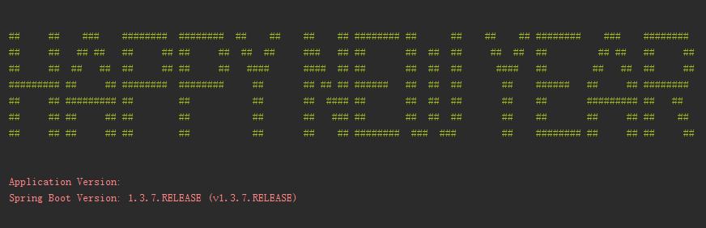
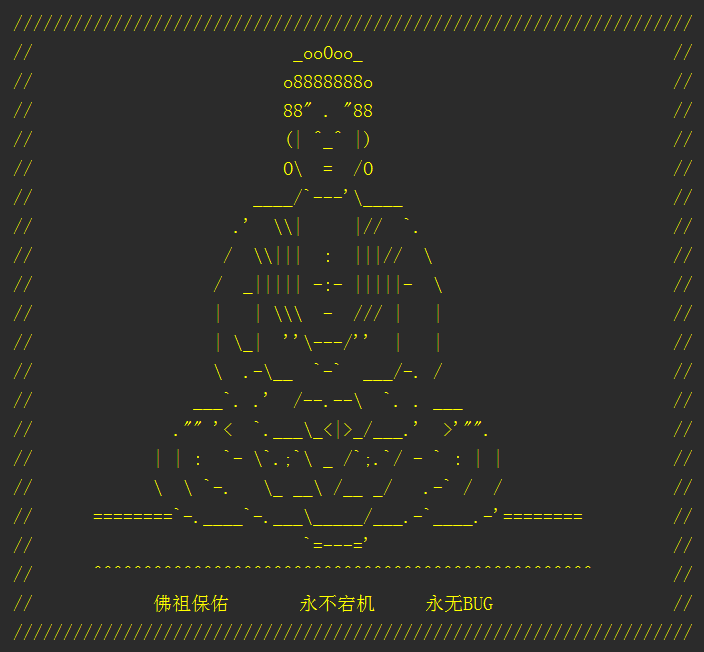

在2016年的最后一天，借用Spring Boot的Banner向各位程序猿同仁们问候一声：Happy New Year。



接下来我们就来介绍一下这个轻松愉快的自定义banner功能。实现的方式非常简单，我们只需要在Spring Boot工程的/src/main/resources目录下创建一个banner.txt文件，然后将ASCII字符画复制进去，就能替换默认的banner了。比如上图中的输出，就采用了下面的banner.txt内容：

```
${AnsiColor.BRIGHT_GREEN}

##     ##    ###    ########  ########  ##    ##    ##    ## ######## ##      ##    ##    ## ########    ###    ########
##     ##   ## ##   ##     ## ##     ##  ##  ##     ###   ## ##       ##  ##  ##     ##  ##  ##         ## ##   ##     ##
##     ##  ##   ##  ##     ## ##     ##   ####      ####  ## ##       ##  ##  ##      ####   ##        ##   ##  ##     ##
######### ##     ## ########  ########     ##       ## ## ## ######   ##  ##  ##       ##    ######   ##     ## ########
##     ## ######### ##        ##           ##       ##  #### ##       ##  ##  ##       ##    ##       ######### ##   ##
##     ## ##     ## ##        ##           ##       ##   ### ##       ##  ##  ##       ##    ##       ##     ## ##    ##
##     ## ##     ## ##        ##           ##       ##    ## ########  ###  ###        ##    ######## ##     ## ##     ##

${AnsiColor.BRIGHT_RED}
Application Version: ${application.version}${application.formatted-version}
Spring Boot Version: ${spring-boot.version}${spring-boot.formatted-version}

```
从上面的内容中可以看到，还使用了一些属性设置：

* ${AnsiColor.BRIGHT_RED}：设置控制台中输出内容的颜色
* ${application.version}：用来获取MANIFEST.MF文件中的版本号
* ${application.formatted-version}：格式化后的${application.version}版本信息
* ${spring-boot.version}：Spring Boot的版本号
* ${spring-boot.formatted-version}：格式化后的${spring-boot.version}版本信息

### 生成工具

如果让我们手工的来编辑这些字符画，显然是一件非常困难的差事。所以，我们可以借助下面这些工具，轻松地根据文字或图片来生成用于Banner输出的字符画。

* [http://patorjk.com/software/taag](http://patorjk.com/software/taag)
* [http://www.network-science.de/ascii/](http://www.network-science.de/ascii/)
* [http://www.degraeve.com/img2txt.w](http://www.degraeve.com/img2txt.w)

### 年终彩蛋

最后，奉上程序猿必备Banner “永不宕机佛祖”，祝大家：“新年快乐、永不宕机、永无Bug”！

```
${AnsiColor.BRIGHT_YELLOW}
////////////////////////////////////////////////////////////////////
//                          _ooOoo_                               //
//                         o8888888o                              //
//                         88" . "88                              //
//                         (| ^_^ |)                              //
//                         O\  =  /O                              //
//                      ____/`---'\____                           //
//                    .'  \\|     |//  `.                         //
//                   /  \\|||  :  |||//  \                        //
//                  /  _||||| -:- |||||-  \                       //
//                  |   | \\\  -  /// |   |                       //
//                  | \_|  ''\---/''  |   |                       //
//                  \  .-\__  `-`  ___/-. /                       //
//                ___`. .'  /--.--\  `. . ___                     //
//              ."" '<  `.___\_<|>_/___.'  >'"".                  //
//            | | :  `- \`.;`\ _ /`;.`/ - ` : | |                 //
//            \  \ `-.   \_ __\ /__ _/   .-` /  /                 //
//      ========`-.____`-.___\_____/___.-`____.-'========         //
//                           `=---='                              //
//      ^^^^^^^^^^^^^^^^^^^^^^^^^^^^^^^^^^^^^^^^^^^^^^^^^^        //
//            佛祖保佑       永不宕机     永无BUG                  //
////////////////////////////////////////////////////////////////////

```
效果图：

