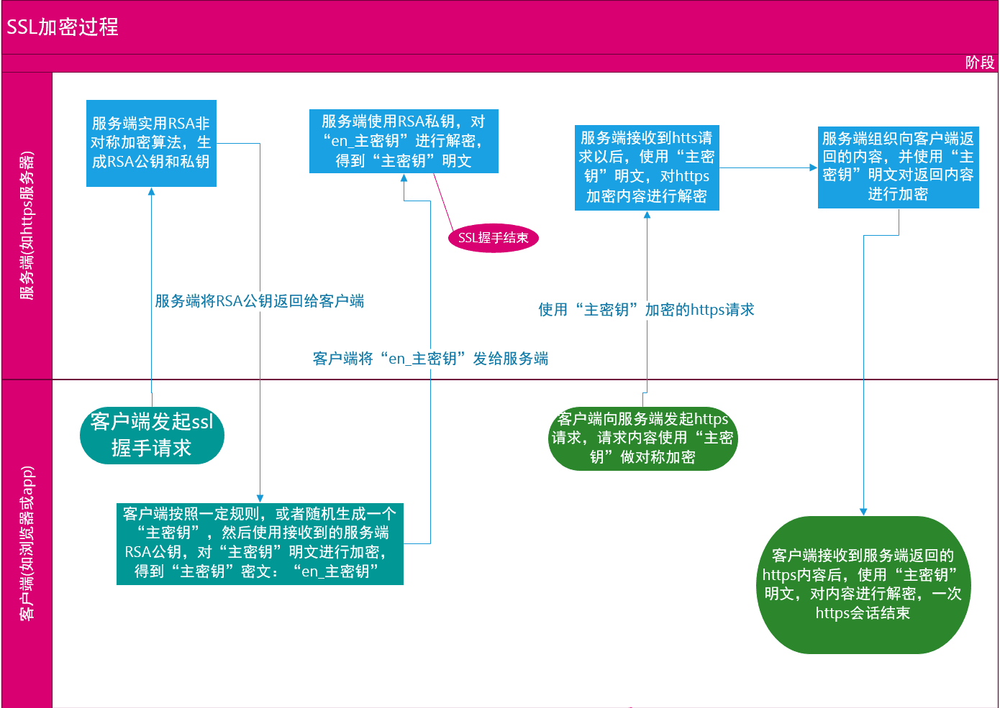
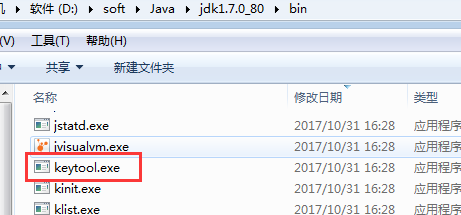
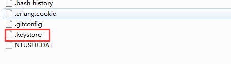
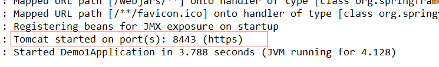
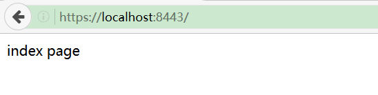
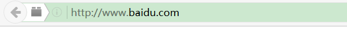
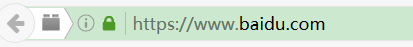
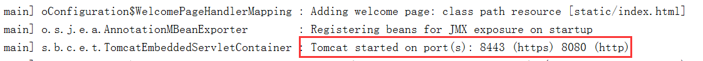

SSL的配置也是我们在实际应用中经常遇到的场景。
SSL(Secure Sockets Layer)，安全套接层)是为网络通信提供安全以及数据完整性的一种安全协议,SSL在网络传输层对网络连接进行加密。SSL协议位于TCP/IP协议与各种应用层协议之间,为数据通信提供安全支持。SSL协议可以分为两层：SSL记录协议(SSL Record Protocol),它建立在可靠的传输协议(如TCP)之上,为高层协议提供数据封装,压缩,加密等基本功能的支持。SSL握手协议(SSL Handshaker Protocol),它建立在SSL记录协议之上,用于在实际数据传输开始前,通信双方进行身份认证,协商加密算法,交换加密密钥等。SSL的加密过程如下图所示:



而在基于B/S的Web应用中,是通过HTTPS来实现SSL的。HTTPS是以安全为目标的HTTP通道,简单讲是HTTP的安全版,即在HTTP下加入SSL层,HTTPS的安全基础设施是SSL。
因为Spring Boot用的是内嵌的Tomcat,因而需要做SSL配置的时候需要做如下的操作  

### 1. 生成证书
使用SSL首先需要一个证书,这个证书既可以是自签名的,也可以是从SSL证书授权中心获得的。下面为了演示方便,演示自授权证书的生成。

每个JDK或者JRE里面都有一个工具叫keytool,它是一个证书管理工具,可以用来生成自签名的证书,
jdk的bin目录，如下图所示:  



在控制台输入如下命令,然后按照提示操作,如下图所示:

```
keytool -genkey -alias tomcat

```

这时候就在当前目录下生成了一个.keystore文件,这就是我们要用到的证书文件,如下图所示:  



### 2.Spring Boot配置SSL

添加一个index.html到src/main/resources/static下,作为测试。
将.keystore文件复制到项目的根目录下,然后在application.properties中做如下的SSL配置：

```
server.port = 8443
server.ssl.key-store = .keystore
server.ssl.key-store-password= 123456
server.ssl.keyStoreType= JKS
server.ssl.keyAlias=tomcat

```
此时启动Spring Boot,控制台输出效果如下图所示:



此时访问：https://localhost:8443,效果如下图所示:



### 3. http转向https

很多时候我们在地址栏输入的是http,但是会自动转向到https,例如我们访问百度的时候,如下图所示:

    


要实现这个功能,需要配置TomcatEmbeddedServletContainerFactory,并且添加Tomcat的connector来实现。
这时候代码需要做如下的配置编写：

```
package org.light4j.springBoot.web.ssl;

import org.apache.catalina.Context;
import org.apache.catalina.connector.Connector;
import org.apache.tomcat.util.descriptor.web.SecurityCollection;
import org.apache.tomcat.util.descriptor.web.SecurityConstraint;
import org.springframework.boot.SpringApplication;
import org.springframework.boot.autoconfigure.SpringBootApplication;
import org.springframework.boot.context.embedded.EmbeddedServletContainerFactory;
import org.springframework.boot.context.embedded.tomcat.TomcatEmbeddedServletContainerFactory;
import org.springframework.context.annotation.Bean;

@SpringBootApplication
public class DemoSSLApplication {

    public static void main(String[] args) {
        SpringApplication.run(DemoSSLApplication.class, args);
    }

    @Bean
    public EmbeddedServletContainerFactory servletContainer() {
        TomcatEmbeddedServletContainerFactory tomcat = new TomcatEmbeddedServletContainerFactory() {
            @Override
            protected void postProcessContext(Context context) {
                SecurityConstraint securityConstraint = new SecurityConstraint();
                securityConstraint.setUserConstraint("CONFIDENTIAL");
                SecurityCollection collection = new SecurityCollection();
                collection.addPattern("/*");
                securityConstraint.addCollection(collection);
                context.addConstraint(securityConstraint);
            }
        };

        tomcat.addAdditionalTomcatConnectors(httpConnector());
        return tomcat;
    }

    @Bean
    public Connector httpConnector() {
        Connector connector = new Connector("org.apache.coyote.http11.Http11NioProtocol");
        connector.setScheme("http");
        connector.setPort(8080);
        connector.setSecure(false);
        connector.setRedirectPort(8443);
        return connector;
    }
}

```
此时启动Spring Boot,控制台输出效果如下图所示:




