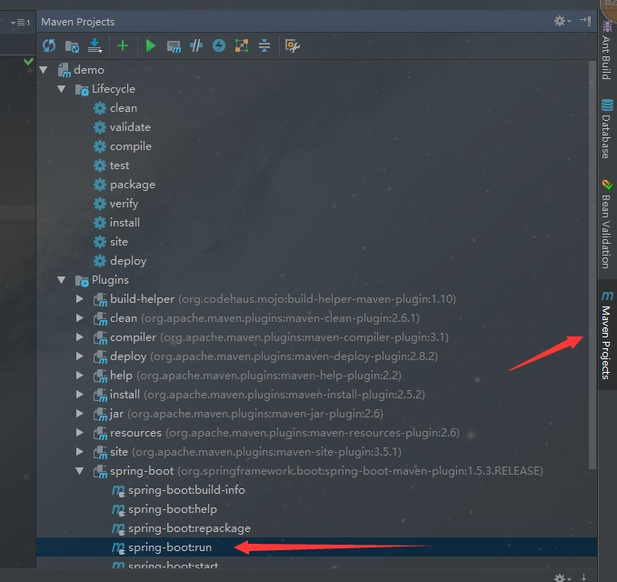
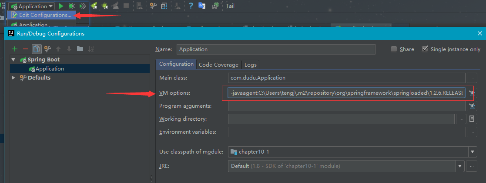
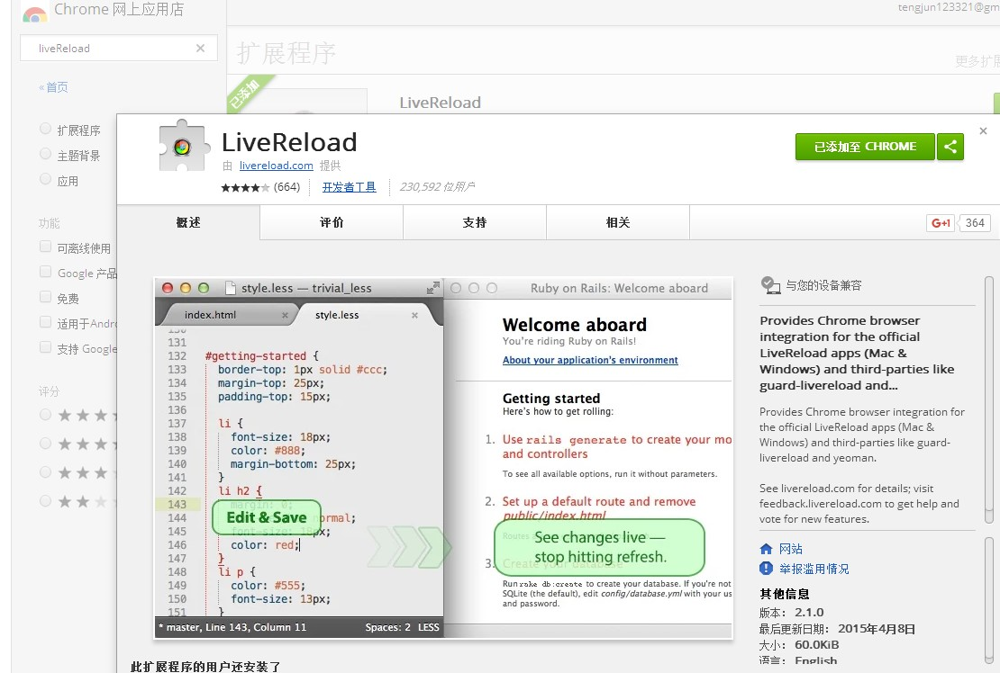
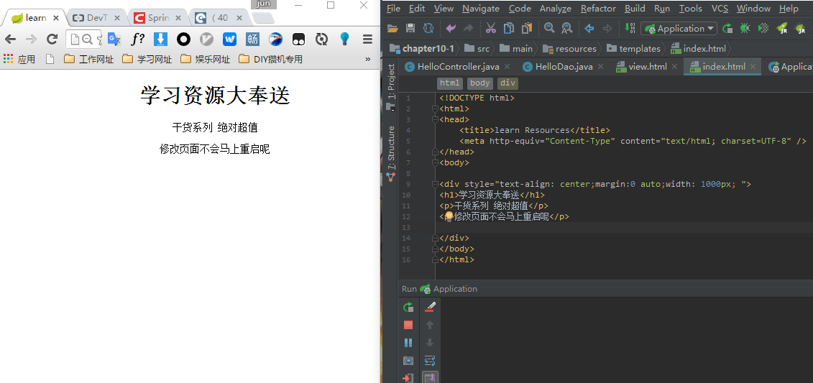
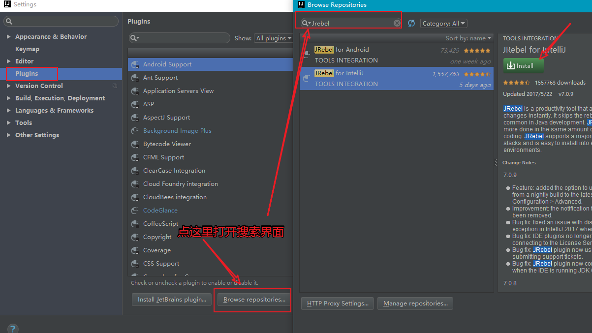
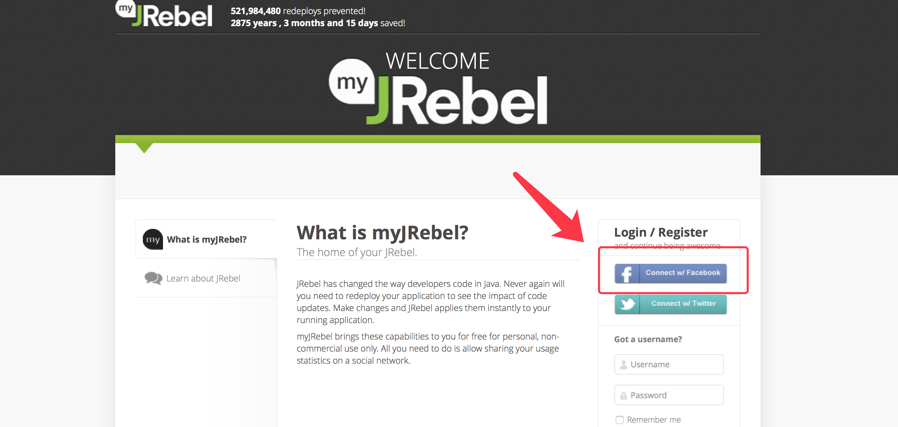
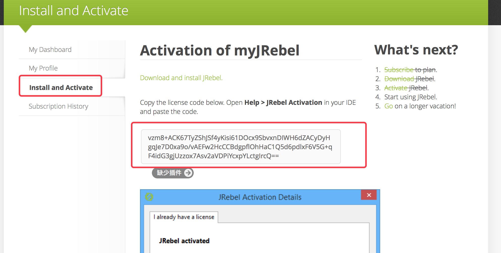
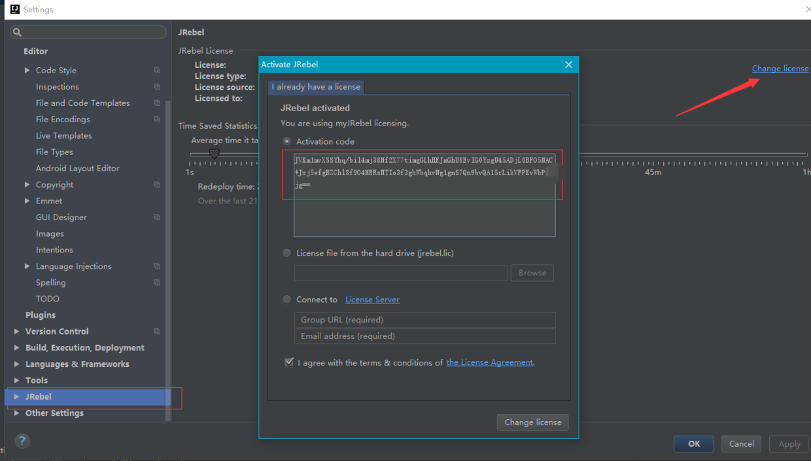
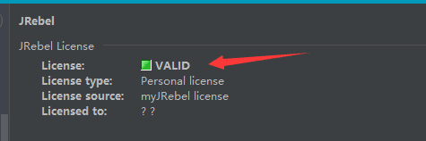
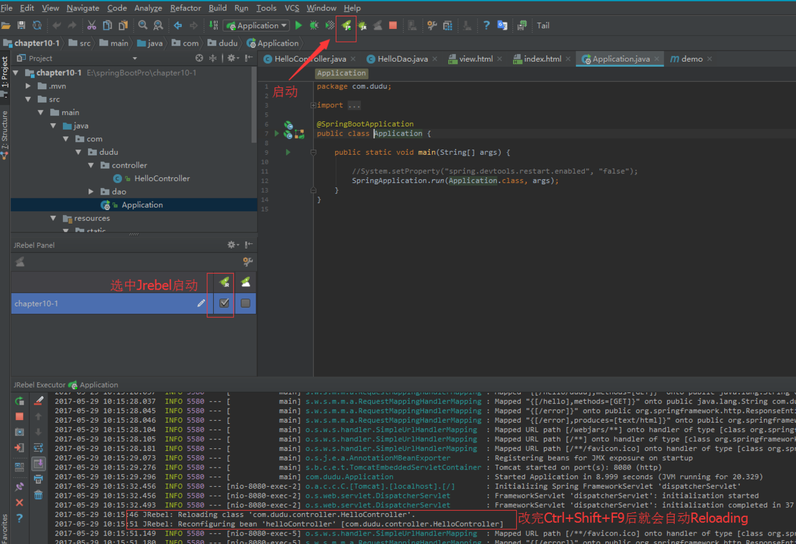

## 前言

平时开发Sprig Boot的时候，经常改动个小小的地方就要重新启动项目，这无疑是一种很差的体验。在此，博主收集了3种热部署的方案供大家选择。

## 正文

目前博主用过的有三种：

* Spring Loaded
* spring-boot-devtools
* JRebel插件

## 博主开发环境
* 系统：win10
* 开发工具：IDE:IntelliJ IDEA 2017.1
* spring-boot版本：1.5.3RELEASE
* JDK：1.8

### Spring Loaded 实现热部署

Spring Loaded是一个用于在JVM运行时重新加载类文件更改的JVM代理,Spring Loaded允许你动态的新增/修改/删除某个方法/字段/构造方法,同样可以修改作用在类/方法/字段/构造方法上的注解.也可以新增/删除/改变枚举中的值。

spring-loaded是一个开源项目,项目地址:[https://github.com/spring-projects/spring-loaded](https://github.com/spring-projects/spring-loaded)

Spring Loaded有两种方式实现，分别是Maven引入依赖方式或者添加启动参数方式

#### Maven依赖方式
```
<plugin>
    <groupId>org.springframework.boot</groupId>
    <artifactId>spring-boot-maven-plugin</artifactId>
    <dependencies>
        <dependency>
        <groupId>org.springframework</groupId>
        <artifactId>springloaded</artifactId>
        <version>1.2.6.RELEASE</version>
        </dependency>
    </dependencies>
</plugin>

```
启动：`mvn spring-boot:run`

如果你也是IDEA的话，直接界面上双击运行即可，如下图



> 注意：maven依赖的方式只适合spring-boot:run的启动方式，右键那种方式不行。

出现如下配置表实配置成功：
```
[INFO] Attaching agents: [C:\Users\tengj\.m2\repository\org\springframework\springloaded\1.2.6.RELEASE\springloaded-1.2.6.RELEASE.jar]

```
#### 添加启动参数方式

这种方式是右键运行启动类
首先先下载对应的springloaded-1.2.6.RELEASE.jar，可以去上面提到的官网获取
博主这里直接引用maven依赖已经下载好的路径哈

然后打开下图所示的Edit Configurations配置，在VM options中输入：
```
-javaagent:C:\Users\tengj\.m2\repository\org\springframework\springloaded\1.2.6.RELEASE\springloaded-1.2.6.RELEASE.jar -noverify

```



然后直接右键运行启动类即可启动项目。

上面2种方式小伙伴随便选择一种即可,当系统通过 mvn spring-boot:run启动或者 右键application debug启动Java文件时，系统会监视classes文件，当有classes文件被改动时，系统会重新加载类文件，不用重启启动服务。

> 注：IDEA下需要重新编译文件 Ctrl+Shift+F9或者编译项目 Ctrl+F9

如何测试热部署是否可用呢，你可以先写个简单的Controller方法，返回个字符串，然后启动项目，接着修改下这个方法返回的字符串，Ctrl+Shift+F9编译下当前类，然后再刷新下页面看看是否内容改变了。

在 Spring Boot，模板引擎的页面默认是开启缓存，如果修改页面内容，刷新页面是无法获取修改后的页面内容，所以，如果我们不需要模板引擎的缓存，可以进行关闭。
```
spring.freemarker.cache=false
spring.thymeleaf.cache=false
spring.velocity.cache=false

```
经过博主简单的测试，发现大多数情况可以使用热部署，有效的解决了文章头部中提到的那个痛点，不过还是有一些情况下需要重新启动，不可用的情况如下：
```
1：对于一些第三方框架的注解的修改，不能自动加载，比如：spring mvc的@RequestMapping
2：application.properties的修改也不行
3：log4j的配置文件的修改不能即时生效

```

### spring-boot-devtools 实现热部署

spring-boot-devtools为应用提供一些开发时特性，包括默认值设置，自动重启，livereload等。

想要使用devtools热部署功能，maven添加依赖如下：
```
<dependencies>
    <dependency>
        <groupId>org.springframework.boot</groupId>
        <artifactId>spring-boot-devtools</artifactId>
        <optional>true</optional>
    </dependency>
</dependencies>

```
将依赖关系标记为可选`<optional>true</optional>`是一种最佳做法，可以防止使用项目将devtools传递性地应用于其他模块。

#### 默认属性

在Spring Boot集成Thymeleaf时，spring.thymeleaf.cache属性设置为false可以禁用模板引擎编译的缓存结果。

现在，devtools会自动帮你做到这些，禁用所有模板的缓存，包括Thymeleaf, Freemarker, Groovy Templates, Velocity, Mustache等。

更多的属性，请参考[DevToolsPropertyDefaultsPostProcessor](https://github.com/spring-projects/spring-boot/blob/v1.5.3.RELEASE/spring-boot-devtools/src/main/java/org/springframework/boot/devtools/env/DevToolsPropertyDefaultsPostProcessor.java)。

#### 自动重启

自动重启的原理在于spring boot使用两个classloader：不改变的类（如第三方jar）由`base`类加载器加载，正在开发的类由`restart`类加载器加载。应用重启时，`restart`类加载器被扔掉重建，而base类加载器不变，这种方法意味着应用程序重新启动通常比“冷启动”快得多，因为`base`类加载器已经可用并已填充。

所以，当我们开启devtools后，classpath中的文件变化会导致应用自动重启。
当然不同的IDE效果不一样，Eclipse中保存文件即可引起classpath更新(注：需要打开自动编译)，从而触发重启。而IDEA则需要自己手动`CTRL+F9`重新编译一下（感觉IDEA这种更好，不然每修改一个地方就重启，好蛋疼）

**排除静态资源文件**

静态资源文件在改变之后有时候没必要触发应用程序重启，例如thymeleaf模板文件就可以实时编辑，默认情况下，更改/META-INF/maven, /META-INF/resources ,/resources ,/static ,/public 或/templates下的资源不会触发重启，而是触发live reload（devtools内嵌了一个LiveReload server，当资源发生改变时，浏览器刷新,下面会介绍）。

可以使用spring.devtools.restart.exclude属性配置，例如
```
spring.devtools.restart.exclude=static/**,public/**

```
如果想保留默认配置，同时增加新的配置，则可使用
```
spring.devtools.restart.additional-exclude属性
```
**观察额外的路径** 

如果你想观察不在classpath中的路径的文件变化并触发重启，则可以配置 `spring.devtools.restart.additional-paths` 属性。

不在classpath内的path可以配置`spring.devtools.restart.additionalpaths`属性来增加到监视中，同时配置`spring.devtools.restart.exclude`可以选择这些path的变化是导致restart还是live reload。

**关闭自动重启**

设置 `spring.devtools.restart.enabled` 属性为false，可以关闭该特性。可以在application.properties中设置，也可以通过设置环境变量的方式。
```
public static void main(String[] args) {
    System.setProperty("spring.devtools.restart.enabled", "false");
    SpringApplication.run(MyApp.class, args);
}

```
**使用一个触发文件**

若不想每次修改都触发自动重启，可以设置spring.devtools.restart.trigger-file指向某个文件，只有更改这个文件时才触发自动重启。

**自定义自动重启类加载器**

默认时，IDE中打开的项目都会由`restart`加载器加载，jar文件由Base加载器加载，但是若你使用multi-module的项目，并且不是所有模块都被导入到IDE中，此时会导致加载器不一致。这时你可以创建`META-INF/spring-devtools.properties`文件，并增加`restart.exclude.XXX，restart.include.XXX`来配置哪些jar被restart加载，哪些被base加载。如：
```
restart.include.companycommonlibs=/mycorp-common-[\\w-]+\.jar
restart.include.projectcommon=/mycorp-myproj-[\\w-]+\.jar
```
**LiveReload**

DevTools内置了一个LiveReload服务,可以在资源变化时用来触发浏览器刷新。当然这个需要你浏览器安装了LiveReload插件，并且启动这个插件才行。很有意思，这里介绍下如何弄。

先去谷歌商店安装LiveReload插件，自己准备梯子。



安装好在要自动刷新的页面点击下图中图标，启动应用后更新页面内容或者css等都会触发页面自动刷新了。如下图，圈中的就是，点一下会变黑就是启动了。


最后展示效果，修改完html页面后，Ctrl+Shift+F9,没有重启，页面也会自动刷新了，太有趣了。



如果您不想在应用程序运行时启动LiveReload服务器，则可以将`spring.devtools.livereload.enabled`属性设置为false。

一次只能运行一个LiveReload服务器。开始应用程序之前，请确保没有其他LiveReload服务器正在运行。
如果你的IDE启动多个应用程序，则只有第一个应用程序将支持LiveReload。

### JRebel插件方式

在IDEA中打开插件管理界面，按照下面的提示先安装上



安装完插件后，需要去获取正版的激活码，这个可以直接去官网https://my.jrebel.com获取(需自备梯子)

1：通过fackbook登录，没有就去注册一个



2：填写一些资料后(资料必须填写完整,否则JRebel激活不了)，复制激活码即可



3：重启IDEA后，在IDEA的Settings中找到JRebel输入复制的激活码即可



出现绿色，即表示激活成功了。



4： 接着就如下所示，勾中JRebel方式后启动即可，即可享受JRebel带来的超爽体验



> 注：修改完毕，`Ctrl+Shift+F9`后就会自动Reloading

总结
以上就是平时Spring Boot开发中常用的热部署方式，小伙伴可以自己试试喜欢哪种就用哪种。
