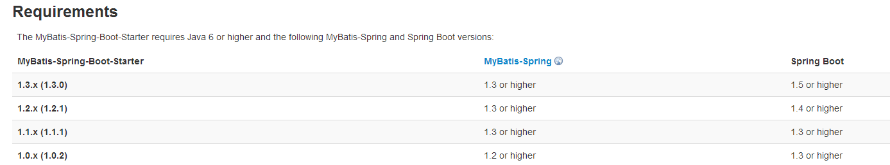
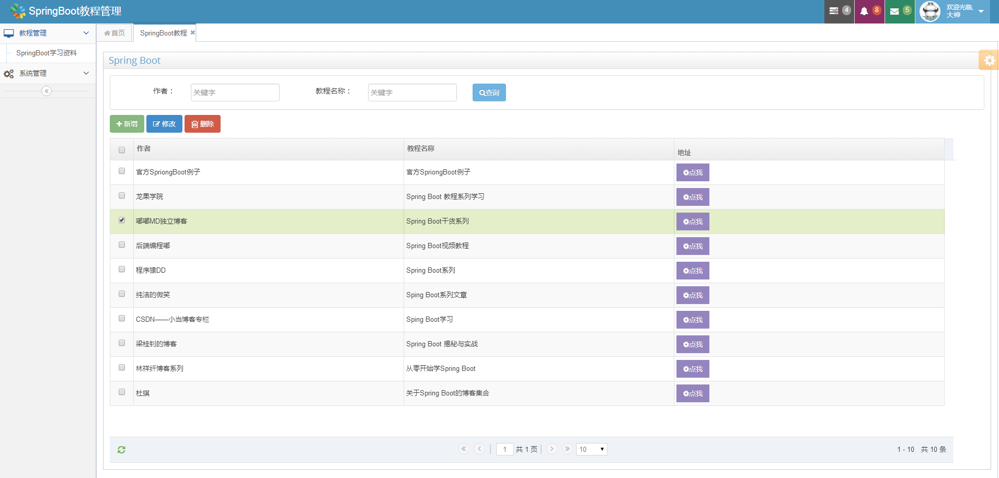

## 前言
上篇我们介绍了Spring Boot对传统JdbcTemplate的集成，这次换一下，介绍下Spring Boot中如何集成MyBatis。这里分别介绍注解方式以及XML方式的整合。喜欢哪种方式自己选择。

## 正文
项目框架还是跟上一篇一样使用Spring Boot的ace后端模板，你可以基于它来跟着博主一起来调整代码，如果没看过上一篇，那就下载本篇源码研究吧。

跟上篇一样先添加基础的依赖和数据源。

### 添加依赖

这里需要添加mybatis-spring-boot-starter依赖跟mysql依赖
```
<!--最新版本，匹配spring Boot1.5 or higher-->
<dependency>
    <groupId>org.mybatis.spring.boot</groupId>
    <artifactId>mybatis-spring-boot-starter</artifactId>
    <version>1.3.0</version>
</dependency>

<dependency>
    <groupId>mysql</groupId>
    <artifactId>mysql-connector-java</artifactId>
</dependency>
```
这里不引入spring-boot-starter-jdbc依赖，是由于mybatis-spring-boot-starter中已经包含了此依赖。

博主开始整理的时候发现mybatis-spring-boot-starter有新版本了，这里就集成最新的，匹配Spring Boot1.5版本。



MyBatis-Spring-Boot-Starter依赖将会提供如下：

* 自动检测现有的DataSource
* 将创建并注册SqlSessionFactory的实例，该实例使用SqlSessionFactoryBean将该DataSource作为输入进行传递
* 将创建并注册从SqlSessionFactory中获取的SqlSessionTemplate的实例。
* 自动扫描您的mappers，将它们链接到SqlSessionTemplate并将其注册到Spring上下文，以便将它们注入到您的bean中。

就是说，使用了该Starter之后，只需要定义一个DataSource即可（application.properties中可配置），它会自动创建使用该DataSource的SqlSessionFactoryBean以及SqlSessionTemplate。会自动扫描你的Mappers，连接到SqlSessionTemplate，并注册到Spring上下文中。

### 数据源配置
在src/main/resources/application.properties中配置数据源信息。
```
spring.datasource.url = jdbc:mysql://localhost:3306/spring?useUnicode=true&characterEncoding=utf-8
spring.datasource.username = root
spring.datasource.password = root
spring.datasource.driver-class-name = com.mysql.jdbc.Driver

```
### 自定义数据源

Spring Boot默认使用tomcat-jdbc数据源，如果你想使用其他的数据源，比如这里使用了阿里巴巴的数据池管理,除了在application.properties配置数据源之外，你应该额外添加以下依赖：
```
<dependency>
    <groupId>com.alibaba</groupId>
    <artifactId>druid</artifactId>
    <version>1.0.19</version>
</dependency>

```
修改Application.java
```java
@SpringBootApplication
public class Application {

    public static void main(String[] args) {
        SpringApplication.run(Application.class, args);
    }

    @Autowired
    private Environment env;

    //destroy-method="close"的作用是当数据库连接不使用的时候,就把该连接重新放到数据池中,方便下次使用调用.
    @Bean(destroyMethod =  "close")
    public DataSource dataSource() {
        DruidDataSource dataSource = new DruidDataSource();
        dataSource.setUrl(env.getProperty("spring.datasource.url"));
        dataSource.setUsername(env.getProperty("spring.datasource.username"));//用户名
        dataSource.setPassword(env.getProperty("spring.datasource.password"));//密码
        dataSource.setDriverClassName(env.getProperty("spring.datasource.driver-class-name"));
        dataSource.setInitialSize(2);//初始化时建立物理连接的个数
        dataSource.setMaxActive(20);//最大连接池数量
        dataSource.setMinIdle(0);//最小连接池数量
        dataSource.setMaxWait(60000);//获取连接时最大等待时间，单位毫秒。
        dataSource.setValidationQuery("SELECT 1");//用来检测连接是否有效的sql
        dataSource.setTestOnBorrow(false);//申请连接时执行validationQuery检测连接是否有效
        dataSource.setTestWhileIdle(true);//建议配置为true，不影响性能，并且保证安全性。
        dataSource.setPoolPreparedStatements(false);//是否缓存preparedStatement，也就是PSCache
        return dataSource;
    }
}

```
ok这样就算自己配置了一个DataSource，Spring Boot会智能地选择我们自己配置的这个DataSource实例。
### 脚本初始化
```sql
CREATE DATABASE /*!32312 IF NOT EXISTS*/`spring` /*!40100 DEFAULT CHARACTER SET utf8 */;
USE `spring`;
DROP TABLE IF EXISTS `learn_resource`;

CREATE TABLE `learn_resource` (
  `id` bigint(20) NOT NULL AUTO_INCREMENT COMMENT 'ID',
  `author` varchar(20) DEFAULT NULL COMMENT '作者',
  `title` varchar(100) DEFAULT NULL COMMENT '描述',
  `url` varchar(100) DEFAULT NULL COMMENT '地址链接',
  PRIMARY KEY (`id`)
) ENGINE=MyISAM AUTO_INCREMENT=1029 DEFAULT CHARSET=utf8;

insert into `learn_resource`(`id`,`author`,`title`,`url`) values (999,'官方SpriongBoot例子','官方SpriongBoot例子','https://github.com/spring-projects/spring-boot/tree/master/spring-boot-samples');
insert into `learn_resource`(`id`,`author`,`title`,`url`) values (1000,'龙果学院','Spring Boot 教程系列学习','http://www.roncoo.com/article/detail/124661');
insert into `learn_resource`(`id`,`author`,`title`,`url`) values (1001,'嘟嘟MD独立博客','Spring Boot干货系列','http://tengj.top/');
insert into `learn_resource`(`id`,`author`,`title`,`url`) values (1002,'后端编程嘟','Spring Boot视频教程','http://www.toutiao.com/m1559096720023553/');

```
### 注解方式跟XML配置方式共同的模块编码

不管是注解方式还是XML配置的方式，以下代码模块都是一样的

#### 实体对象
```
public class LearnResouce {
    private Long id;
    private String author;
    private String title;
    private String url;
    // SET和GET方法
}
```
#### Controller层
```
/** 教程页面
 * Created by tengj on 2017/3/13.
 */
@Controller
@RequestMapping("/learn")
public class LearnController {
    @Autowired
    private LearnService learnService;
    private Logger logger = LoggerFactory.getLogger(this.getClass());

    @RequestMapping("")
    public String learn(){
        return "learn-resource";
    }

    @RequestMapping(value = "/queryLeanList",method = RequestMethod.POST,produces="application/json;charset=UTF-8")
    @ResponseBody
    public void queryLearnList(HttpServletRequest request ,HttpServletResponse response){
        String page = request.getParameter("page"); // 取得当前页数,注意这是jqgrid自身的参数
        String rows = request.getParameter("rows"); // 取得每页显示行数，,注意这是jqgrid自身的参数
        String author = request.getParameter("author");
        String title = request.getParameter("title");
        Map<String,Object> params = new HashMap<String,Object>();
        params.put("page", page);
        params.put("rows", rows);
        params.put("author", author);
        params.put("title", title);
        List<LearnResouce> learnList=learnService.queryLearnResouceList(params);
        PageInfo<LearnResouce> pageInfo =new PageInfo<LearnResouce>(learnList);
        JSONObject jo=new JSONObject();
        jo.put("rows", learnList);
        jo.put("total", pageInfo.getPages());//总页数
        jo.put("records",pageInfo.getTotal());//查询出的总记录数
        ServletUtil.createSuccessResponse(200, jo, response);
    }
    /**
     * 新添教程
     * @param request
     * @param response
     */
    @RequestMapping(value = "/add",method = RequestMethod.POST)
    public void addLearn(HttpServletRequest request , HttpServletResponse response){
        JSONObject result=new JSONObject();
        String author = request.getParameter("author");
        String title = request.getParameter("title");
        String url = request.getParameter("url");
        if(StringUtil.isNull(author)){
            result.put("message","作者不能为空!");
            result.put("flag",false);
            ServletUtil.createSuccessResponse(200, result, response);
            return;
        }
        if(StringUtil.isNull(title)){
            result.put("message","教程名称不能为空!");
            result.put("flag",false);
            ServletUtil.createSuccessResponse(200, result, response);
            return;
        }
        if(StringUtil.isNull(url)){
            result.put("message","地址不能为空!");
            result.put("flag",false);
            ServletUtil.createSuccessResponse(200, result, response);
            return;
        }
        LearnResouce learnResouce = new LearnResouce();
        learnResouce.setAuthor(author);
        learnResouce.setTitle(title);
        learnResouce.setUrl(url);
        int index=learnService.add(learnResouce);
        if(index>0){
            result.put("message","教程信息添加成功!");
            result.put("flag",true);
        }else{
            result.put("message","教程信息添加失败!");
            result.put("flag",false);
        }
        ServletUtil.createSuccessResponse(200, result, response);
    }
    /**
     * 修改教程
     * @param request
     * @param response
     */
    @RequestMapping(value = "/update",method = RequestMethod.POST)
    public void updateLearn(HttpServletRequest request , HttpServletResponse response){
        JSONObject result=new JSONObject();
        String id = request.getParameter("id");
        LearnResouce learnResouce=learnService.queryLearnResouceById(Long.valueOf(id));
        String author = request.getParameter("author");
        String title = request.getParameter("title");
        String url = request.getParameter("url");
        if(StringUtil.isNull(author)){
            result.put("message","作者不能为空!");
            result.put("flag",false);
            ServletUtil.createSuccessResponse(200, result, response);
            return;
        }
        if(StringUtil.isNull(title)){
            result.put("message","教程名称不能为空!");
            result.put("flag",false);
            ServletUtil.createSuccessResponse(200, result, response);
            return;
        }
        if(StringUtil.isNull(url)){
            result.put("message","地址不能为空!");
            result.put("flag",false);
            ServletUtil.createSuccessResponse(200, result, response);
            return;
        }
        learnResouce.setAuthor(author);
        learnResouce.setTitle(title);
        learnResouce.setUrl(url);
        int index=learnService.update(learnResouce);
        System.out.println("修改结果="+index);
        if(index>0){
            result.put("message","教程信息修改成功!");
            result.put("flag",true);
        }else{
            result.put("message","教程信息修改失败!");
            result.put("flag",false);
        }
        ServletUtil.createSuccessResponse(200, result, response);
    }
    /**
     * 删除教程
     * @param request
     * @param response
     */
    @RequestMapping(value="/delete",method = RequestMethod.POST)
    @ResponseBody
    public void deleteUser(HttpServletRequest request ,HttpServletResponse response){
        String ids = request.getParameter("ids");
        System.out.println("ids==="+ids);
        JSONObject result = new JSONObject();
        //删除操作
        int index = learnService.deleteByIds(ids.split(","));
        if(index>0){
            result.put("message","教程信息删除成功!");
            result.put("flag",true);
        }else{
            result.put("message","教程信息删除失败!");
            result.put("flag",false);
        }
        ServletUtil.createSuccessResponse(200, result, response);
    }
}

```
#### Service层
```
package com.dudu.service;
public interface LearnService {
    int add(LearnResouce learnResouce);
    int update(LearnResouce learnResouce);
    int deleteByIds(String[] ids);
    LearnResouce queryLearnResouceById(Long learnResouce);
    List<LearnResouce> queryLearnResouceList(Map<String, Object> params);
}

```
#### 实现类
```
package com.dudu.service.impl;

/**
 * Created by tengj on 2017/4/7.
 */
@Service
public class LearnServiceImpl implements LearnService {

    @Autowired
    LearnMapper learnMapper;
    @Override
    public int add(LearnResouce learnResouce) {
        return this.learnMapper.add(learnResouce);
    }

    @Override
    public int update(LearnResouce learnResouce) {
        return this.learnMapper.update(learnResouce);
    }

    @Override
    public int deleteByIds(String[] ids) {
        return this.learnMapper.deleteByIds(ids);
    }

    @Override
    public LearnResouce queryLearnResouceById(Long id) {
        return this.learnMapper.queryLearnResouceById(id);
    }

    @Override
    public List<LearnResouce> queryLearnResouceList(Map<String,Object> params) {
        PageHelper.startPage(Integer.parseInt(params.get("page").toString()), Integer.parseInt(params.get("rows").toString()));
        return this.learnMapper.queryLearnResouceList(params);
    }
}

```
### Mybatis集成

接下来，我们分别来介绍下注解方式以及XML配置方式。

#### 方案一：注解方式

Mybatis注解的方式好简单，只要定义一个dao接口，然后sql语句通过注解写在接口方法上。最后给这个接口添加@Mapper注解或者在启动类上添加@MapperScan(“com.dudu.dao”)注解都行。

如下：
```
package com.dudu.dao;
/**
 * Created by tengj on 2017/4/22.
 * Component注解不添加也没事，只是不加service那边引入LearnMapper会有错误提示，但不影响
 */
@Component
@Mapper
public interface LearnMapper {
    @Insert("insert into learn_resource(author, title,url) values(#{author},#{title},#{url})")
    int add(LearnResouce learnResouce);

    @Update("update learn_resource set author=#{author},title=#{title},url=#{url} where id = #{id}")
    int update(LearnResouce learnResouce);

    @DeleteProvider(type = LearnSqlBuilder.class, method = "deleteByids")
    int deleteByIds(@Param("ids") String[] ids);


    @Select("select * from learn_resource where id = #{id}")
    @Results(id = "learnMap", value = {
            @Result(column = "id", property = "id", javaType = Long.class),
            @Result(property = "author", column = "author", javaType = String.class),
            @Result(property = "title", column = "title", javaType = String.class)
    })
    LearnResouce queryLearnResouceById(@Param("id") Long id);

    @SelectProvider(type = LearnSqlBuilder.class, method = "queryLearnResouceByParams")
    List<LearnResouce> queryLearnResouceList(Map<String, Object> params);

    class LearnSqlBuilder {
        public String queryLearnResouceByParams(final Map<String, Object> params) {
            StringBuffer sql =new StringBuffer();
            sql.append("select * from learn_resource where 1=1");
            if(!StringUtil.isNull((String)params.get("author"))){
                sql.append(" and author like '%").append((String)params.get("author")).append("%'");
            }
            if(!StringUtil.isNull((String)params.get("title"))){
                sql.append(" and title like '%").append((String)params.get("title")).append("%'");
            }
            System.out.println("查询sql=="+sql.toString());
            return sql.toString();
        }

        //删除的方法
        public String deleteByids(@Param("ids") final String[] ids){
            StringBuffer sql =new StringBuffer();
            sql.append("DELETE FROM learn_resource WHERE id in(");
            for (int i=0;i<ids.length;i++){
                if(i==ids.length-1){
                    sql.append(ids[i]);
                }else{
                    sql.append(ids[i]).append(",");
                }
            }
            sql.append(")");
            return sql.toString();
        }
    }
}

```
需要注意的是，简单的语句只需要使用`@Insert`、`@Update`、`@Delete`、`@Select`这4个注解即可，但是有些复杂点需要动态SQL语句，就比如上面方法中根据查询条件是否有值来动态添加sql的，就需要使用`@InsertProvider`、`@UpdateProvider`、`@DeleteProvider`、`@SelectProvider`等注解。

这些可选的 SQL 注解允许你指定一个类名和一个方法在执行时来返回运行 允许创建动态 的 SQL。 基于执行的映射语句, MyBatis 会实例化这个类,然后执行由 provider 指定的方法. 该方法可以有选择地接受参数对象.(In MyBatis 3.4 or later, it’s allow multiple parameters) 属性: `type`,`method`。`type` 属性是类。`method` 属性是方法名。 注意: 这节之后是对 类的 讨论,它可以帮助你以干净,容于阅读 的方式来构建动态 SQL。

#### 方案二：XML配置方式
xml配置方式保持映射文件的老传统，优化主要体现在不需要实现dao的是实现层，系统会自动根据方法名在映射文件中找对应的sql，具体操作如下：

**编写Dao层的代码**

新建LearnMapper接口，无需具体实现类。
```
package com.dudu.dao;
@Mapper
public interface LearnMapper {
    int add(LearnResouce learnResouce);
    int update(LearnResouce learnResouce);
    int deleteByIds(String[] ids);
    LearnResouce queryLearnResouceById(Long id);
    public List<LearnResouce> queryLearnResouceList(Map<String, Object> params);
}

```
**修改application.properties 配置文件**
```
#指定bean所在包
mybatis.type-aliases-package=com.dudu.domain
#指定映射文件
mybatis.mapperLocations=classpath:mapper/*.xml

```
**添加LearnMapper的映射文件**

在`src/main/resources`目录下新建一个`mapper`目录，在`mapper`目录下新建`LearnMapper.xml`文件。

通过`mapper`标签中的`namespace`属性指定对应的`dao`映射，这里指向`LearnMapper`。
```
<?xml version="1.0" encoding="UTF-8"?>
<!DOCTYPE mapper PUBLIC "-//mybatis.org//DTD Mapper 3.0//EN" "http://mybatis.org/dtd/mybatis-3-mapper.dtd">
<mapper namespace="com.dudu.dao.LearnMapper">
  <resultMap id="baseResultMap" type="com.dudu.domain.LearnResouce">
    <id column="id" property="id" jdbcType="BIGINT"  />
    <result column="author" property="author" jdbcType="VARCHAR"/>
    <result column="title" property="title" jdbcType="VARCHAR"/>
    <result column="url" property="url" jdbcType="VARCHAR"/>
  </resultMap>

  <sql id="baseColumnList" >
    id, author, title,url
  </sql>

  <select id="queryLearnResouceList" resultMap="baseResultMap" parameterType="java.util.HashMap">
    select
    <include refid="baseColumnList" />
    from learn_resource
    <where>
      1 = 1
      <if test="author!= null and author !=''">
        AND author like CONCAT(CONCAT('%',#{author,jdbcType=VARCHAR}),'%')
      </if>
      <if test="title != null and title !=''">
        AND title like  CONCAT(CONCAT('%',#{title,jdbcType=VARCHAR}),'%')
      </if>

    </where>
  </select>

  <select id="queryLearnResouceById"  resultMap="baseResultMap" parameterType="java.lang.Long">
    SELECT
    <include refid="baseColumnList" />
    FROM learn_resource
    WHERE id = #{id}
  </select>

  <insert id="add" parameterType="com.dudu.domain.LearnResouce" >
    INSERT INTO learn_resource (author, title,url) VALUES (#{author}, #{title}, #{url})
  </insert>

  <update id="update" parameterType="com.dudu.domain.LearnResouce" >
    UPDATE learn_resource SET author = #{author},title = #{title},url = #{url} WHERE id = #{id}
  </update>

  <delete id="deleteByIds" parameterType="java.lang.String" >
    DELETE FROM learn_resource WHERE id in
    <foreach item="idItem" collection="array" open="(" separator="," close=")">
      #{idItem}
    </foreach>
  </delete>
</mapper>

```
更多mybatis数据访问操作的使用请参考：[mybatis官方中文参考文档](http://www.mybatis.org/mybatis-3/zh/java-api.html)

### 分页插件

上面我有使用到物理分页插件`pagehelper`，用法还算简单，配置如下
pom.xml中添加依赖
```
<dependency>
    <groupId>com.github.pagehelper</groupId>
    <artifactId>pagehelper-spring-boot-starter</artifactId>
    <version>1.1.0</version>
</dependency>

```
然后你只需在查询list之前使用`PageHelper.startPage(int pageNum, int pageSize)`方法即可。`pageNum`是第几页，`pageSize`是每页多少条。
```
@Override
    public List<LearnResouce> queryLearnResouceList(Map<String,Object> params) {
        PageHelper.startPage(Integer.parseInt(params.get("page").toString()), Integer.parseInt(params.get("rows").toString()));
        return this.learnMapper.queryLearnResouceList(params);
    }
    
```
分页插件`PageHelper`项目地址： [https://github.com/pagehelper/Mybatis-PageHelper](https://github.com/pagehelper/Mybatis-PageHelper)

最终项目效果如下,增删改查分页一个都不少：



总结
到此为止，Spring Boot与Mybatis的初步整合就完成了，项目不仅整合了bootstrap模板框架，还包含了登录、拦截器、日志框架logback等前面介绍的功能。麻雀虽小，五脏俱全。
