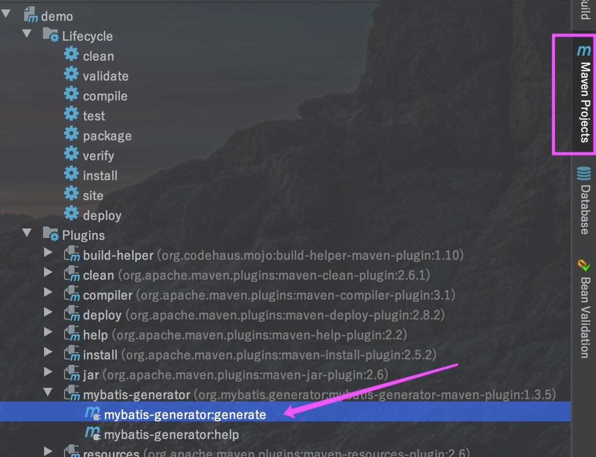
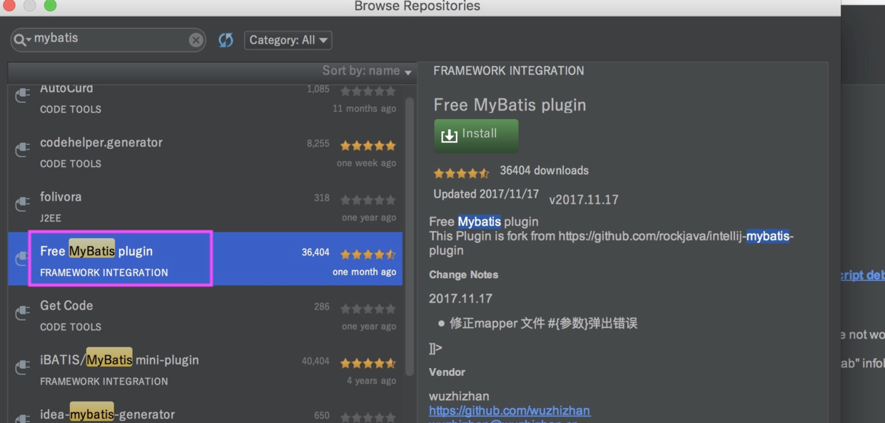
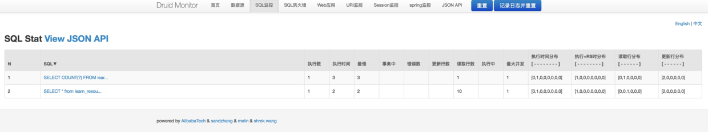

### 前言
上次介绍了Spring Boot中Mybatis的简单整合，本篇深入来结合通用Mapper、Mybatis Geneator以及分页PageHelper来打造适合企业开发的模板框架。

### 正文
项目框架还是跟上一篇一样使用Spring Boot的ace后端模板，不过最近在使用vue，所以前端引用了vue进来改写，代码变得更加简洁。

项目配置：

* Spring Boot： 1.5.9.RELEASE
* Maven： 3.5
* Java： 1.8
* Thymeleaf： 3.0.7.RELEASE
* Vue.js： v2.5.11

#### 数据源依赖
这里我们还是使用阿里巴巴的druid来当数据库连接池，发现这个有对应的监控界面，我们可以开启。
druid官方文档：[https://github.com/alibaba/druid/wiki/](https://github.com/alibaba/druid/wiki/)常见问题
```
<dependency>
	<groupId>mysql</groupId>
	<artifactId>mysql-connector-java</artifactId>
</dependency>

<dependency>
	<groupId>com.alibaba</groupId>
	<artifactId>druid</artifactId>
	<version>1.0.19</version>
</dependency>

```
对应的application.properties配置：
```
## 数据库访问配置
spring.datasource.type=com.alibaba.druid.pool.DruidDataSource
spring.datasource.driver-class-name = com.mysql.jdbc.Driver
spring.datasource.url = jdbc:mysql://localhost:3306/spring?useUnicode=true&characterEncoding=utf-8
spring.datasource.username = root
spring.datasource.password = root

# 下面为连接池的补充设置，应用到上面所有数据源中
# 初始化大小，最小，最大
spring.datasource.initialSize=5
spring.datasource.minIdle=5
spring.datasource.maxActive=20
# 配置获取连接等待超时的时间
spring.datasource.maxWait=60000
# 配置间隔多久才进行一次检测，检测需要关闭的空闲连接，单位是毫秒
spring.datasource.timeBetweenEvictionRunsMillis=60000
# 配置一个连接在池中最小生存的时间，单位是毫秒
spring.datasource.minEvictableIdleTimeMillis=300000
spring.datasource.validationQuery=SELECT 1 FROM DUAL
spring.datasource.testWhileIdle=true
spring.datasource.testOnBorrow=false
spring.datasource.testOnReturn=false
# 打开PSCache，并且指定每个连接上PSCache的大小
spring.datasource.poolPreparedStatements=true
spring.datasource.maxPoolPreparedStatementPerConnectionSize=20
# 配置监控统计拦截的filters，去掉后监控界面sql无法统计，'wall'用于防火墙
spring.datasource.filters=stat,wall,log4j
# 合并多个DruidDataSource的监控数据
#spring.datasource.useGlobalDataSourceStat=true

```
对应的bean配置：
```
package com.dudu.config;

/**
 * Druid配置
 *
 * @author dudu
 * @date 2017-12-11 0:00
 */
@Configuration
public class DruidConfig {
    private Logger logger = LoggerFactory.getLogger(DruidConfig.class);

    @Value("${spring.datasource.url:#{null}}")
    private String dbUrl;
    @Value("${spring.datasource.username: #{null}}")
    private String username;
    @Value("${spring.datasource.password:#{null}}")
    private String password;
    @Value("${spring.datasource.driverClassName:#{null}}")
    private String driverClassName;
    @Value("${spring.datasource.initialSize:#{null}}")
    private Integer initialSize;
    @Value("${spring.datasource.minIdle:#{null}}")
    private Integer minIdle;
    @Value("${spring.datasource.maxActive:#{null}}")
    private Integer maxActive;
    @Value("${spring.datasource.maxWait:#{null}}")
    private Integer maxWait;
    @Value("${spring.datasource.timeBetweenEvictionRunsMillis:#{null}}")
    private Integer timeBetweenEvictionRunsMillis;
    @Value("${spring.datasource.minEvictableIdleTimeMillis:#{null}}")
    private Integer minEvictableIdleTimeMillis;
    @Value("${spring.datasource.validationQuery:#{null}}")
    private String validationQuery;
    @Value("${spring.datasource.testWhileIdle:#{null}}")
    private Boolean testWhileIdle;
    @Value("${spring.datasource.testOnBorrow:#{null}}")
    private Boolean testOnBorrow;
    @Value("${spring.datasource.testOnReturn:#{null}}")
    private Boolean testOnReturn;
    @Value("${spring.datasource.poolPreparedStatements:#{null}}")
    private Boolean poolPreparedStatements;
    @Value("${spring.datasource.maxPoolPreparedStatementPerConnectionSize:#{null}}")
    private Integer maxPoolPreparedStatementPerConnectionSize;
    @Value("${spring.datasource.filters:#{null}}")
    private String filters;
    @Value("{spring.datasource.connectionProperties:#{null}}")
    private String connectionProperties;

    @Bean
    @Primary
    public DataSource dataSource(){
        DruidDataSource datasource = new DruidDataSource();

        datasource.setUrl(this.dbUrl);
        datasource.setUsername(username);
        datasource.setPassword(password);
        datasource.setDriverClassName(driverClassName);
        //configuration
        if(initialSize != null) {
            datasource.setInitialSize(initialSize);
        }
        if(minIdle != null) {
            datasource.setMinIdle(minIdle);
        }
        if(maxActive != null) {
            datasource.setMaxActive(maxActive);
        }
        if(maxWait != null) {
            datasource.setMaxWait(maxWait);
        }
        if(timeBetweenEvictionRunsMillis != null) {
            datasource.setTimeBetweenEvictionRunsMillis(timeBetweenEvictionRunsMillis);
        }
        if(minEvictableIdleTimeMillis != null) {
            datasource.setMinEvictableIdleTimeMillis(minEvictableIdleTimeMillis);
        }
        if(validationQuery!=null) {
            datasource.setValidationQuery(validationQuery);
        }
        if(testWhileIdle != null) {
            datasource.setTestWhileIdle(testWhileIdle);
        }
        if(testOnBorrow != null) {
            datasource.setTestOnBorrow(testOnBorrow);
        }
        if(testOnReturn != null) {
            datasource.setTestOnReturn(testOnReturn);
        }
        if(poolPreparedStatements != null) {
            datasource.setPoolPreparedStatements(poolPreparedStatements);
        }
        if(maxPoolPreparedStatementPerConnectionSize != null) {
            datasource.setMaxPoolPreparedStatementPerConnectionSize(maxPoolPreparedStatementPerConnectionSize);
        }

        if(connectionProperties != null) {
            datasource.setConnectionProperties(connectionProperties);
        }

        List<Filter> filters = new ArrayList<>();
        filters.add(statFilter());
        filters.add(wallFilter());
        datasource.setProxyFilters(filters);

        return datasource;
    }

    @Bean
    public ServletRegistrationBean druidServlet() {
        ServletRegistrationBean servletRegistrationBean = new ServletRegistrationBean(new StatViewServlet(), "/druid/*");

        //控制台管理用户，加入下面2行 进入druid后台就需要登录
        //servletRegistrationBean.addInitParameter("loginUsername", "admin");
        //servletRegistrationBean.addInitParameter("loginPassword", "admin");
        return servletRegistrationBean;
    }

    @Bean
    public FilterRegistrationBean filterRegistrationBean() {
        FilterRegistrationBean filterRegistrationBean = new FilterRegistrationBean();
        filterRegistrationBean.setFilter(new WebStatFilter());
        filterRegistrationBean.addUrlPatterns("/*");
        filterRegistrationBean.addInitParameter("exclusions", "*.js,*.gif,*.jpg,*.png,*.css,*.ico,/druid/*");
        filterRegistrationBean.addInitParameter("profileEnable", "true");
        return filterRegistrationBean;
    }

    @Bean
    public StatFilter statFilter(){
        StatFilter statFilter = new StatFilter();
        statFilter.setLogSlowSql(true); //slowSqlMillis用来配置SQL慢的标准，执行时间超过slowSqlMillis的就是慢。
        statFilter.setMergeSql(true); //SQL合并配置
        statFilter.setSlowSqlMillis(1000);//slowSqlMillis的缺省值为3000，也就是3秒。
        return statFilter;
    }

    @Bean
    public WallFilter wallFilter(){
        WallFilter wallFilter = new WallFilter();
        //允许执行多条SQL
        WallConfig config = new WallConfig();
        config.setMultiStatementAllow(true);
        wallFilter.setConfig(config);
        return wallFilter;
    }
}

```
#### mybatis相关依赖
```
<!--mybatis-->
<dependency>
	<groupId>org.mybatis.spring.boot</groupId>
	<artifactId>mybatis-spring-boot-starter</artifactId>
	<version>1.3.1</version>
</dependency>
<!--通用mapper-->
<dependency>
	<groupId>tk.mybatis</groupId>
	<artifactId>mapper-spring-boot-starter</artifactId>
	<version>1.1.5</version>
</dependency>
<!--pagehelper 分页插件-->
<dependency>
	<groupId>com.github.pagehelper</groupId>
	<artifactId>pagehelper-spring-boot-starter</artifactId>
	<version>1.2.3</version>
</dependency>

<build>
	<plugins>
		<plugin>
			<groupId>org.springframework.boot</groupId>
			<artifactId>spring-boot-maven-plugin</artifactId>
		</plugin>

		<plugin>
			<groupId>org.mybatis.generator</groupId>
			<artifactId>mybatis-generator-maven-plugin</artifactId>
			<version>1.3.5</version>
			<dependencies>
				<!--配置这个依赖主要是为了等下在配置mybatis-generator.xml的时候可以不用配置classPathEntry这样的一个属性，避免代码的耦合度太高-->
				<dependency>
					<groupId>mysql</groupId>
					<artifactId>mysql-connector-java</artifactId>
					<version>5.1.44</version>
				</dependency>
				<dependency>
					<groupId>tk.mybatis</groupId>
					<artifactId>mapper</artifactId>
					<version>3.4.0</version>
				</dependency>
			</dependencies>
			<executions>
				<execution>
					<id>Generate MyBatis Artifacts</id>
					<phase>package</phase>
					<goals>
						<goal>generate</goal>
					</goals>
				</execution>
			</executions>
			<configuration>
				<!--允许移动生成的文件 -->
				<verbose>true</verbose>
				<!-- 是否覆盖 -->
				<overwrite>true</overwrite>
				<!-- 自动生成的配置 -->
				<configurationFile>src/main/resources/mybatis-generator.xml</configurationFile>
			</configuration>
		</plugin>
	</plugins>
</build>

```
上面引入了mybatis相关的一些依赖以及generator的配置，这里generator配置文件指向
src/main/resources/mybatis-generator.xml文件，具体一会贴出。

对应的application.properties配置：
```
#指定bean所在包
mybatis.type-aliases-package=com.dudu.domain
#指定映射文件
mybatis.mapperLocations=classpath:mapper/*.xml

#mapper
#mappers 多个接口时逗号隔开
mapper.mappers=com.dudu.util.MyMapper
mapper.not-empty=false
mapper.identity=MYSQL

#pagehelper
pagehelper.helperDialect=mysql
pagehelper.reasonable=true
pagehelper.supportMethodsArguments=true
pagehelper.params=count=countSql

```
#### 通用Mapper配置

通用Mapper都可以极大的方便开发人员,对单表封装了许多通用方法，省掉自己写增删改查的sql。
通用Mapper插件网址：[https://github.com/abel533/Mapper](https://github.com/abel533/Mapper)

```
package com.dudu.util;

import tk.mybatis.mapper.common.Mapper;
import tk.mybatis.mapper.common.MySqlMapper;

/**
 * 继承自己的MyMapper
 *
 * @author
 * @since 2017-06-26 21:53
 */
public interface MyMapper<T> extends Mapper<T>, MySqlMapper<T> {
    //FIXME 特别注意，该接口不能被扫描到，否则会出错
}

```
这里实现一个自己的接口,继承通用的mapper，关键点就是这个接口不能被扫描到，不能跟dao这个存放mapper文件放在一起。

最后在启动类中通过MapperScan注解指定扫描的mapper路径：
```
package com.dudu;
@SpringBootApplication
//启注解事务管理
@EnableTransactionManagement  // 启注解事务管理，等同于xml配置方式的 <tx:annotation-driven />
@MapperScan(basePackages = "com.dudu.dao", markerInterface = MyMapper.class)
public class Application {
	public static void main(String[] args) {
		SpringApplication.run(Application.class, args);
	}
}

```
#### MyBatis Generator配置

这里配置一下上面提到的mybatis-generator.xml文件,该配置文件用来自动生成表对应的Model,Mapper以及xml,该文件位于src/main/resources下面
Mybatis Geneator 详解: [http://blog.csdn.net/isea533/article/details/42102297](http://blog.csdn.net/isea533/article/details/42102297)
```
<?xml version="1.0" encoding="UTF-8"?>
<!DOCTYPE generatorConfiguration
        PUBLIC "-//mybatis.org//DTD MyBatis Generator Configuration 1.0//EN"
        "http://mybatis.org/dtd/mybatis-generator-config_1_0.dtd">
<generatorConfiguration>
    <!--加载配置文件，为下面读取数据库信息准备-->
    <properties resource="application.properties"/>

    <context id="Mysql" targetRuntime="MyBatis3Simple" defaultModelType="flat">

        <plugin type="tk.mybatis.mapper.generator.MapperPlugin">
            <property name="mappers" value="com.dudu.util.MyMapper" />
            <!--caseSensitive默认false，当数据库表名区分大小写时，可以将该属性设置为true-->
          <property name="caseSensitive" v
          alue="true"/>
        </plugin>

        <!-- 阻止生成自动注释 -->
        <commentGenerator>
            <property name="javaFileEncoding" value="UTF-8"/>
            <property name="suppressDate" value="true"/>
            <property name="suppressAllComments" value="true"/>
        </commentGenerator>

        <!--数据库链接地址账号密码-->
        <jdbcConnection driverClass="${spring.datasource.driver-class-name}"
                        connectionURL="${spring.datasource.url}"
                        userId="${spring.datasource.username}"
                        password="${spring.datasource.password}">
        </jdbcConnection>

        <javaTypeResolver>
            <property name="forceBigDecimals" value="false"/>
        </javaTypeResolver>

        <!--生成Model类存放位置-->
        <javaModelGenerator targetPackage="com.dudu.domain" targetProject="src/main/java">
            <property name="enableSubPackages" value="true"/>
            <property name="trimStrings" value="true"/>
        </javaModelGenerator>

        <!--生成映射文件存放位置-->
        <sqlMapGenerator targetPackage="mapper" targetProject="src/main/resources">
            <property name="enableSubPackages" value="true"/>
        </sqlMapGenerator>

        <!--生成Dao类存放位置-->
        <!-- 客户端代码，生成易于使用的针对Model对象和XML配置文件 的代码
                type="ANNOTATEDMAPPER",生成Java Model 和基于注解的Mapper对象
                type="XMLMAPPER",生成SQLMap XML文件和独立的Mapper接口
        -->
       <javaClientGenerator type="XMLMAPPER" targetPackage="com.dudu.dao" targetProject="src/main/java">
            <property name="enableSubPackages" value="true"/>
       </javaClientGenerator>

        <!--生成对应表及类名
        去掉Mybatis Generator生成的一堆 example
        -->
        <table tableName="LEARN_RESOURCE" domainObjectName="LearnResource" enableCountByExample="false" enableUpdateByExample="false" enableDeleteByExample="false" enableSelectByExample="false" selectByExampleQueryId="false">
            <generatedKey column="id" sqlStatement="Mysql" identity="true"/>
        </table>
    </context>
</generatorConfiguration>

```
其中，我们通过`<properties resource="application.properties"/>`引入了配置文件，这样下面指定数据源的时候不用写死。

其中`tk.mybatis.mapper.generator.MapperPlugin`很重要，用来指定通用Mapper对应的文件，这样我们生成的mapper都会继承这个通用Mapper
```
<plugin type="tk.mybatis.mapper.generator.MapperPlugin">
	<property name="mappers" value="com.dudu.util.MyMapper" />
  <!--caseSensitive默认false，当数据库表名区分大小写时，可以将该属性设置为true-->
  <property name="caseSensitive" value="true"/>
</plugin>

```
这样就可以通过mybatis-generator插件生成对应的文件啦



如果不是IDEA开发环境也可以直接通过命令：`mvn mybatis-generator:generate`

自动生成的文件如下图所示

[mybatis-generator自动生成文件](imgs/springboot11-2.png)

#### 脚本初始化

```sql
CREATE DATABASE /*!32312 IF NOT EXISTS*/`spring` /*!40100 DEFAULT CHARACTER SET utf8 */;
USE `spring`;
DROP TABLE IF EXISTS `learn_resource`;

CREATE TABLE `learn_resource` (
  `id` bigint(20) NOT NULL AUTO_INCREMENT COMMENT 'ID',
  `author` varchar(20) DEFAULT NULL COMMENT '作者',
  `title` varchar(100) DEFAULT NULL COMMENT '描述',
  `url` varchar(100) DEFAULT NULL COMMENT '地址链接',
  PRIMARY KEY (`id`)
) ENGINE=MyISAM AUTO_INCREMENT=1029 DEFAULT CHARSET=utf8;

insert into `learn_resource`(`id`,`author`,`title`,`url`) values (999,'官方SpriongBoot例子','官方SpriongBoot例子','https://github.com/spring-projects/spring-boot/tree/master/spring-boot-samples');
insert into `learn_resource`(`id`,`author`,`title`,`url`) values (1000,'龙果学院','Spring Boot 教程系列学习','http://www.roncoo.com/article/detail/124661');
insert into `learn_resource`(`id`,`author`,`title`,`url`) values (1001,'嘟嘟MD独立博客','Spring Boot干货系列','http://tengj.top/');
insert into `learn_resource`(`id`,`author`,`title`,`url`) values (1002,'后端编程嘟','Spring Boot视频教程','http://www.toutiao.com/m1559096720023553/');

```
#### Controller层

到此为止，基本的配置结束了，我们开始实现业务的逻辑，Controller层代码如下
```
/** 教程页面
 * Created by tengj on 2017/12/19
 */
@Controller
@RequestMapping("/learn")
public class LearnController  extends AbstractController{
    @Autowired
    private LearnService learnService;
    private Logger logger = LoggerFactory.getLogger(this.getClass());

    @RequestMapping("")
    public String learn(Model model){
        model.addAttribute("ctx", getContextPath()+"/");
        return "learn-resource";
    }

    /**
     * 查询教程列表
     * @param page
     * @return
     */
    @RequestMapping(value = "/queryLeanList",method = RequestMethod.POST)
    @ResponseBody
    public AjaxObject queryLearnList(Page<LeanQueryLeanListReq> page){
        List<LearnResource> learnList=learnService.queryLearnResouceList(page);
        PageInfo<LearnResource> pageInfo =new PageInfo<LearnResource>(learnList);
        return AjaxObject.ok().put("page", pageInfo);
    }
    /**
     * 新添教程
     * @param learn
     */
    @RequestMapping(value = "/add",method = RequestMethod.POST)
    @ResponseBody
    public AjaxObject addLearn(@RequestBody LearnResource learn){
        learnService.save(learn);
        return AjaxObject.ok();
    }

    /**
     * 修改教程
     * @param learn
     */
    @RequestMapping(value = "/update",method = RequestMethod.POST)
    @ResponseBody
    public AjaxObject updateLearn(@RequestBody LearnResource learn){
        learnService.updateNotNull(learn);
        return AjaxObject.ok();
    }

    /**
     * 删除教程
     * @param ids
     */
    @RequestMapping(value="/delete",method = RequestMethod.POST)
    @ResponseBody
    public AjaxObject deleteLearn(@RequestBody Long[] ids){
        learnService.deleteBatch(ids);
        return AjaxObject.ok();
    }
}

```
#### 通用Service

正常情况下具体业务是每个模块的service里面定义许多方法，然后mapper中实现。

但是博主查看插件文档后发现一个通用Mapper在Spring4中的最佳用法。那就是通用的Service。
具体可以查看这里了解:[https://gitee.com/free/Mapper2/blob/master/wiki/mapper/4.Spring4.md](https://gitee.com/free/Mapper2/blob/master/wiki/mapper/4.Spring4.md)

定义通用service接口
```
/**
 * 通用接口
 */
@Service
public interface IService<T> {

    T selectByKey(Object key);

    int save(T entity);

    int delete(Object key);

    int updateAll(T entity);

    int updateNotNull(T entity);

    List<T> selectByExample(Object example);

    //TODO 其他...
}

```
具体实现通用接口类
```
/**
 * 通用Service
 * @param <T>
 */
public abstract class BaseService<T> implements IService<T> {

    @Autowired
    protected Mapper<T> mapper;
    public Mapper<T> getMapper() {
        return mapper;
    }

    @Override
    public T selectByKey(Object key) {
        //说明：根据主键字段进行查询，方法参数必须包含完整的主键属性，查询条件使用等号
        return mapper.selectByPrimaryKey(key);
    }

    @Override
    public int save(T entity) {
        //说明：保存一个实体，null的属性也会保存，不会使用数据库默认值
        return mapper.insert(entity);
    }

    @Override
    public int delete(Object key) {
        //说明：根据主键字段进行删除，方法参数必须包含完整的主键属性
        return mapper.deleteByPrimaryKey(key);
    }

    @Override
    public int updateAll(T entity) {
        //说明：根据主键更新实体全部字段，null值会被更新
        return mapper.updateByPrimaryKey(entity);
    }

    @Override
    public int updateNotNull(T entity) {
        //根据主键更新属性不为null的值
        return mapper.updateByPrimaryKeySelective(entity);
    }

    @Override
    public List<T> selectByExample(Object example) {
        //说明：根据Example条件进行查询
        //重点：这个查询支持通过Example类指定查询列，通过selectProperties方法指定查询列
        return mapper.selectByExample(example);
    }
}

```
到此基本的增删改查通用service就写好了，具体业务的service就直接继承这个接口即可,也可以添加额外的方法，例如：
```
public interface LearnService  extends IService<LearnResource>{
    public List<LearnResource> queryLearnResouceList(Page<LeanQueryLeanListReq> page);
    public void deleteBatch(Long[] ids);
}

```
具体实现service
```
 /**
 * Created by tengj on 2017/4/7.
 */
@Service
public class LearnServiceImpl extends BaseService<LearnResource>  implements LearnService {

    @Autowired
    private LearnResourceMapper  learnResourceMapper;

    @Override
    public void deleteBatch(Long[] ids) {
        Arrays.stream(ids).forEach(id->learnResourceMapper.deleteByPrimaryKey(id));
    }

    @Override
    public List<LearnResource> queryLearnResouceList(Page<LeanQueryLeanListReq> page) {
        PageHelper.startPage(page.getPage(), page.getRows());
        return learnResourceMapper.queryLearnResouceList(page.getCondition());
    }
}

```
可以看到，具体LearnServiceImpl这边就实现了2个方法，其他的都使用了通用service的，在开发上剩下了许多功夫。

#### Mapper相关

在自动生成的mapper文件中实现sevice自定义的方法：
```
public interface LearnResourceMapper extends MyMapper<LearnResource> {
    List<LearnResource> queryLearnResouceList(Map<String,Object> map);
}

```
LearnResourceMapper.xml：
```
 <?xml version="1.0" encoding="UTF-8"?>
<!DOCTYPE mapper PUBLIC "-//mybatis.org//DTD Mapper 3.0//EN" "http://mybatis.org/dtd/mybatis-3-mapper.dtd">
<mapper namespace="com.dudu.dao.LearnResourceMapper">
  <resultMap id="BaseResultMap" type="com.dudu.domain.LearnResource">
    <!--
      WARNING - @mbg.generated
    -->
    <id column="id" jdbcType="BIGINT" property="id" />
    <result column="author" jdbcType="VARCHAR" property="author" />
    <result column="title" jdbcType="VARCHAR" property="title" />
    <result column="url" jdbcType="VARCHAR" property="url" />
  </resultMap>
    <select id="queryLearnResouceList" resultType="com.dudu.domain.LearnResource">
      SELECT * from learn_resource where 1=1
      <if test="author != null and author!= ''">
        and author like CONCAT('%',#{author},'%')
      </if>
      <if test="title != null and title!= ''">
        and title like CONCAT('%',#{title},'%')
      </if>
      order by id desc
    </select>
</mapper>

```
IDEA可以安装这个插件，这样就可以直接从Mapper文件跳转到xml了




最终项目效果如下,增删改查分页一个都不少：


上面提到druid有对应的监控界面，启动项目后输入`http://localhost:8090/spring/druid` 即可登录，界面效果如下



### 总结

到此，一套适合企业级开发的Spring Boot应用模板就好了，Mybatis+通用Mapper、Mybatis Geneator确实可以省下很多开发成本，提高效率。前端整合了vue.js,具体看[源码](https://github.com/tengj/SpringBootDemo/tree/master)。

